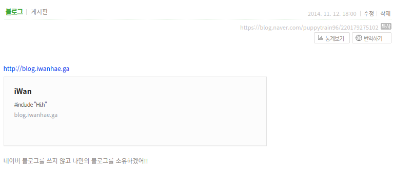

## 서론

필자의 블로그의 역사는 생각보다 오래되었다.

워드프레스로 블로그를 운영했었는데, 현재 하드디스크에서 굴러다니는 언제했는지 모를 워드프레스 mysql DB 백업파일에 의하면 `2012년 06월 11`일에 오류역전파가 어떻게 MLP를 학습시키는가 에대해서 첫 글을 썼다고 나와있다.

 네이버 블로그에 의하면 현재 도메인인 `blog.iwanhae.ga`는 `2014년 11월 12일`에 사용을 시작한것으로 보인다.

 기억하기로는 이 글과 함께 `Wordpress` 에서 `ghost`로 넘어왔던걸로 알고있다. `Wordpress`를 버린 주된 이유는 백업과 복원의 귀찮음 이었다.

 그 당시는 Docker 같은건 몰랐던 시절이라 모든 서버 프로그램을 패키지단위로 손수 설치하고 백업과 복원 스크립트를 만들어서 서버 초기화 & 업그레이드마다 백업하고 복원하다 복원이 안되서 삽질을 했었는데, 당시 복원 절차는 이랬다.

1. nginx, php-fpm, mysql 설치
2. nginx 설정 -> php 연동
3. php 폴더에 wordpress 관련 파일 집어넣기
4. mysql 계정 생성
5. 워드프레스 접속에서 db 접속정보 알려주기
6. [옵션] 버전 업데이트시 마이그레이션 잘 해주기.

서버 초기화때마다 위 과정을 거치는건 귀찮음의 연속이었고, 느렸고, 플러그인 뭐 하나만 깔면 버전문제때문에 망가지는건 허다한 일이었다.

## ghost

이 귀찮은 과정에서 탈출하려고 대안을 찾던중 발견한것이 `ghost` 였다. 당시는 `Javascript`, 특히 `nodejs`가 뜨기 시작했던때라서 `ghost`는 신기술을 적용하여 막 새로나온 블로깅 솔루션이었고 워드프레스보다 훨씬 빨랐으며 무엇보다 외부 DB나 프로그램 필요없이 `SQLite`를 사용해서 다음 과정만 거치면 복원이 가능했다.

1. 압축해제
2. `rc.local`에 `node index.js` 추가하기

게다가 `markdown`을 채용하여서 텍스트만으로 사진 추가나 글 스타일 변경같은것을 쉽게 행할 수 있을 뿐만아니라 그당시 거의 유일한 `wysiwyg` 방식의 마크다운에디터가 웹상에서 제공되어서 글쓰기도 편했다.

 쓰다가 `nodejs` 버전은 올라가는데 ghost는 계속 구버전의 `nodejs`만 이용이 가능하여 `nodejs`바이너리를 통쨰로 들고다녔던 시기도 있었지만, Docker를 쓰게되면서 `ghost`는 명령어 하나만으로 백업과 복원을 자유롭게 할 수 있는 아주 좋은 존재였다.

이렇게 본인은 워드프레스와 비교할때 거의 모든면에서 우위에 있는 `ghost`로 블로그 플랫폼을 옮겼고, 2014년 ~ 2020년까지 약 6년간 잘 이용해왔다. 하지만 최근 ghost는 가볍고 빨랐던 초심을 잃고 많은 단점이 생긴것 같다.

## ghost, 매력을 잃다.

 2020년 10월 현재 `ghost`는 3.0 버전이 나왔으며 처음 ghost를 사용했던 `0.11`버전대비 엄청나게 많은 기능들이 추가되었다. markdown만 지원되던 초기와는 다르게 이제는 Editor 상에서 `Spotify`와 같은 외부 서비스도 추가가 가능해졌다. 하지만 기능과 함께 엄청 느려지게 되었다. 정확히는 서버가 느려진건 아니고 너무나도 방대해진 프론트엔드기능때문에 적어도 `Ryzen 5 3600` 에서는 돌리기가 버거워졌다. 글을 수정하면 1초뒤에 반영이되고, 한글은 깨지며 복사도 제대로 안된다.

 그렇다 이제 ghost는 더이상 좋은 블로깅 플랫폼이라고 하기 미묘해졌다. 대안을 생각해보았고, 요즘 대세는 `github.io `와 함께 정적인 페이지를 `serving`하는것이랜다.

## Hugo

정적인 페이지로 블로그를 운영하는방법은 여럿 있다.

1. 그냥 하나 만들기

   귀찮다.

2. jekyll

   예쁜건 다 LaTeX기반이라 패스....

3. hugo

   Go!

4. hexo

   예쁜 테마가 없다.

5. gatsby

   부드럽지만 "웹"느낌이 안난다.

그냥 Hugo 테마가 마음에 드는게 있어서 Hugo를 사용하였다.

