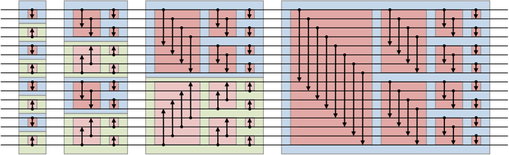

## 서론
정렬알고리즘 뭐가좋아요? 라고 물어본다면

뭐 데이터 개수나 컴퓨터 성능의 제약등 이것저것 따져봐야할께 많이 있기는 하지만 일반적으로 Quick Sort면 대충 해결된다.

하지만, 시대는 더이상 **"단일 스레드를 빠르게!!"**가 아닌 **"엄청 많은 스레드를 같이!!"**의 시대로 변해버렸다.

요즘 대표적인 예가 GPGPU를 활용한 머신러닝 근사값찾기 노가다다.

뭐 그런거 요즘 생각하면서 심심풀이로 CUDA라이브러리 뒤적뒤적하다보니 OpenCL이 튀어나오고 OpenCL뒤적뒤적하다보니 Boost가 튀어나오는데 이놈 뒤적뒤적하다보니.......

음? GPU써서 정렬했는데 훨씬 빠르다고?~~그전에 GPU써서 정렬이 가능해? 항상 Matrix계산만 시켰는데?~~

그거 생각하고 또 뒤적뒤적하다보니 찾아낸게 **Bitonic Sort**와 **oddeven mergesort** 이다.

## 간단 소개

둘다 같은사람이 만들었고, 둘다 **시간복잡도**가 **Olog^2(n)**로 QuickSort가 평균 **Onlogn**인거 생각하면 무척 빠른편에 속한다.

~~(헌데 oddeven mergesort쪽이 Bitonic Sort에 비해 연산량이 더 적다. 데이터 수에따라 다르지만 보통 5-20%정도 더 적다. 데이터가 커질수록 둘이 별 차이 없어지지만)~~

근데 왜 덜유명하냐면 **공간복잡도**가 **Onlog^2(n)**로 큰편에 속한다.

하지만 병렬화가 무척이나 쉬운편에 속해서 멀티코어는 물론이요 GPU에도 써먹을수 있을정도라서 GPGPU분야에서 입문쯤에 존재하는 알고리즘이다.

참고로 이놈들은 **Sorter**나 **Sorting Network**라는 표현으로도 불리는데 그 이유가 **Quick Sort**처럼 데이터에따라 pivot이 달라지고 어떤 배열에서 몇번째데이터랑 몇번째데이타랑 비교할지가 바뀌는게 아니라 **데이터에 상관없이** 항상 몇번째 데이터랑 몇번째 데이터랑 비교할지 이미 정해져 있어서 그렇다고 한다.

## Bitonic Sort
일단 코드부터 (C#)

```c#
class Program
{
    static int[] a; //실제 데이터
    static int[] b; //변하는거 표시용 (안중요)

    static void Main(string[] args)
    {
        a = new int[] { 9, 6, 8, 4, 1, 10, 3, 5, 7, 2 ,16 ,13 ,14 ,15 ,11 ,12 };
        b = new int[] { 9, 6, 8, 4, 1, 10, 3, 5, 7, 2, 16, 13, 14, 15, 11, 12 };
        print();
        BitonicSort(0, a.Length, true);
        return;
    }

    static void BitonicSort(int start, int n, bool isAscending)
    {
        if (n == 1) return;
        int m = n / 2;
        BitonicSort(start, m, true);    //앞에 반쪽 오름차순 정렬
        BitonicSort(start+m, m, false); //뒤에 반쪽 내림차순 정렬

        /*
        결과적으로
            ↗↘
          ↗    ↘
        이런모양이 완성됨.
        */

        BitonicMerge(start, n, isAscending);    //합치기
    }

    static void BitonicMerge(int start, int n, bool isAscending)
    {
        if (n == 1) return;
        int m = n / 2;

        for(int i = start; i < start + m; i++)            
            compare(i, i + m, isAscending);
        //이렇게 함으로써 앞에반쪽의 모든성분은
        //뒤에 반쪽의 성분보다 작게됨.

        /*
        결과적으로
            ↗↘       ↘    ↗
          ↗    ↘ 혹은  ↘↗
        이랬던게
              ↘↗
          ↗↘||||
        이런모양으로 됨.
        */

        BitonicMerge(start, m, isAscending);    //앞의 반쪽 계속 Merge
        BitonicMerge(start+m, m, isAscending);  //뒤의 반쪽 계속 Merge

    }
    static void compare(int i, int j, bool isAscending)
    {
        if (isAscending == (a[i] > a[j]))
        {
            exchange(i, j);
            print();
        }                
    }

    static void exchange(int i, int j)
    {
        int t = a[i];
        a[i] = a[j];
        a[j] = t;
    }

    static void print()
    {
        for(int i = 0; i < a.Length; i++)
        {
            if (b[i] != a[i])
            {
                Console.Write(a[i] + "*\t");
                b[i] = a[i];
            }
            else                
                Console.Write(a[i] + "\t");                             
        }
        Console.WriteLine();
    }
}
```

성분이 2^n 개가 아니라면 좀 상황이 미묘해진다는점 빼고 심플(?)한 코드이다.

좀 생각해보면 알 수 있다싶이 데이터의 성분에 상관없이 항상 비교하는 대상이 정해져있어서 다음과 같은 그림으로도 표현된다.



([위키피디아](https://en.wikipedia.org/wiki/Bitonic_sorter)에서 가져옴)

그리고 이렇게 **data-independent** ~~(한국어로 뭐라할지 미묘.....)~~~~데이터 독립적? 멋없어....~~ 하다보니깐 

작업분배가 편하고 거의 모든과정이 병렬화가 가능해서 ~~(Sync과정이 꽤 필요하긴 하지만)~~

GPGPU, 즉 GPU를 활용해서 정렬하는것이 가능하다.~~(데이터수가 1024^2개가 넘어가면 CPU보다 눈에띄게 빠르다고 한다.)~~

(보통 batcher's oddeven mergesort 를 더 많이 쓴다는듯 하다.)

## batcher's oddeven mergesort
작성중....

-> 작성예정 없음