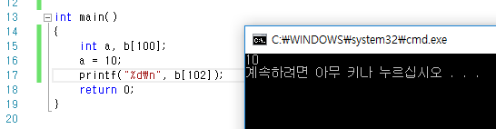

## 변수란 무엇인가?
변수, 영어로는 Variable, Vary(달라지다) + able(가능하다)

뭐 대충 한번쯤 써본적은 있을테니 알꺼라 믿지만 ~~(컴퓨터 아니라도 수학에서 허구한날 쓰니깐)~~ 그래도 고전적이게 한번 써보자면 이것은 그릇이다.

그릇 안에는 0과 1의 조합이 들어있고 그릇에는 그릇 고유의 이름과 그릇의 특성이 있는데 이름은 사용자가 맘대로 정하는거고 그릇의 특성에따라 컴퓨터가 해석하는 방법이 달라진다.

만약 char 특성이면 문자~~(사실 1바이트 숫자지만)~~, INT 특성이면 정수, Float 특성이면 실수,  Bool 특성이면 True,False ~~헌데 C언어는 Bool없다..... _Bool은 GCC에선 있다.)~~

뭐 이런 느낌이다.

어떤식으로 저장되는지는 IEEE문서 어딘가쯤에 적혀있을테니 궁금하면 찾아보도록 하자.

여기서 재미난점은 말했다싶이 **그릇** 속에는 **0**과 **1**이 저장되어있다. 나중에 언급은 하겠지만 (아마도?) 여기서 포인터를 쓰면 특성만 바꾼체로 어떤 그릇속에 있는 정보를 읽어낼 수 있는데 이거 잘 활용하면 Byte(Char)로 저장된 내용을 다른방식으로 읽어내 의미를 보여준다던가 ~~(IP주소 표기할때 가끔씀)~~ Double이나 INT 혹은 다른 저장방식으로 의미를 갖는것을 Byte(Char) 방식으로 읽어내 일반화된 방법으로 압축을 행할수도 있다.

## C언어에서 사용가능한 변수의 종류는?
꽤 많다.

표로 정리해뒀으니 한번 보고 지나가면 된다.

꼭 알아둘것은

Char, Int, Float, Struct, 포인터, 함수포인터 

정도만 기억해두면 된다. (나머지는 필요할때 찾아서 보면 됨)

| 형식                                                | 설명                                                         | 포맷         |
| --------------------------------------------------- | ------------------------------------------------------------ | ------------ |
| char                                                | 보통 1바이트짜리 크기를 가지며 ~~(컴파일러에 따라 8비트가 아니라 7비트인 경우도 있다.)~~ 포인터가 가르키는게 가능한 최소 단위이다. 원래는 메모리공간 하나 다루는데 썼는데 아스키코드도 마침 딱 1바이트크기라 요즘은 문자표현할때 더 자주 쓰인다. | %c           |
| signed char                                         | 부호가 있는 char형. 일반적인 컴파일러에서는 char쓰면 signed char를 의미한다. |              |
| unsigned char                                       | 부호가 없는 char형. 대표적으로 ARM컴파일러에서는 char쓰면 unsigned char를 의미한다. |              |
| short / short int / signed short / signed short int | 최소 2바이트의 크기를 가지는 +-가 존재하는 정수형이다. 컴파일러에따라 더 클수도 있으나 아직까지 그런 컴파일러를 본적은 없다. | %hi / %hd    |
| unsigned short / unsigned short int                 | 부호가 없을뿐 똑같다                                         | %hu          |
| int                                                 | 최소 4바이트의 크기를 가지는 정수                            | %i / %d      |
| unsigned int                                        | 부호가 없는 int형                                            | %u           |
| long int                                            | 최소 8바이트 정수                                            | %li / %ld    |
| long long int                                       | 최소 16바이트 정수                                           | %lli / %lld  |
| float / double  long double                         | 실수를 표현한다. 하지만 그 크기가 정의되있지는 않다. 일반적으로 float가 4바이트고 double이 8바이트이고 long double은 컴파일러마다 따로논다. | %f / %g / %e |
| struct                                              | 위에 나온 자료형들을 조합해서 사용자가 새로 만들수 있는 자료형이다. 한글로 번역하면 구조체 |              |
| array                                               | 배열                                                         |              |
| 포인터                                              | 메모리 상에서 위에 나온 모든 자료형의 시작부분을 가르키는 데이터를 가진다. 포인터 형식에 따라 그 시작부분부터 몇바이트씩 읽어서 어떤식으로 해석할지 결정한다. |              |
| 함수 포인터                                         | 메모리 상에서 어떠한 함수가 저장되어있는 부분의 시작점을 가르킨다. 동적 라이브러리를 읽어오거나 사용자 설정에따라 다른함수를 사용해야할때 자주 쓰인다. |              |


참고로 포인터의 경우 x86환경에서 (즉, 윈도우가 돌아가면)

32bit 컴퓨터에서는 4바이트(=32비트) 64비트 컴퓨터에서는 6바이트(=48비트)의 크기를 가진다.

덤으로 왜 64비트 컴퓨터에서 포인터의 크기가 64비트(=8바이트)가 아니냐면

64비트크기의 포인터로 총 

$${ 2 }^{ 64 }\quad bytes\quad \approx \quad 16\quad Eb$$

크기의 메모리 공간을 가르킬수 있는데 아마 여기까지 메모리가 커질일은 없다고 생각해서(;;)

$${ 2 }^{ 48 }\quad bytes\quad \approx \quad 16\quad Tb$$

로 합의 봤다나 뭐라나.... (쓸일도 없는데 포인터 쓸때마다 2byte씩 낭비가 일어난다는 의미니깐)

## 변수는 어떻게 저장되나?

일단 C언어는 처음 시작될때 운영체제로부터 ~~(운영체제 그 자체인경우는 할당 방법이 미리 지정되어 있으나 여기선 상관없는 얘기)~~ 메모리 공간을 할당받아 `Code` `Data` `Stack` `Heap` 이렇게 네가지 영역으로 나눈다.

`Code`의 경우 이름에서 예상할수 있다싶이 컴파일되어 바이너리[^n]형태로 하드에 저장되있는 내용을 그대로 가져와 넣는 영역이다. 일반적으로 코드 전부를 이 영역에 올리지만, 동적으로 Library를 불러올경우 (DLL파일이나 SO파일 같은것들) 처음에는 없었지만 나중에 불러오는 형식을 취한다.

`Data`의 경우 프로그램 내내 존재해야하는 변수가 저장된다. 대표적으로 Static으로 지정해놓은 변수, 전역변수 지정해 놓은 변수들이 해당된다.

`Stack`의 경우 함수 내에서 호출되는 지역변수들이 저장되는 곳이다. 자료구조배울때 많이나오는 `스택`과 같은 자료구조를 가진다. (지역에서 탈출하면 변수도 사라져야 하는데 이럴때 맨 윗부분만 빼면 되니깐) 흔히 C언어의 문제점으로 언급하는 "Stack Overflow"에러도 함수호출(지역출입)이 너무 많아져서 이 공간이 넘칠때 일어나는 애러를 말한다.

`Heap`이 공간은 동적할당(malloc)에 쓰이는 공간이다. 딱히 그 이상 특별한건 없다. 영어로 "아무렇게나 쌓인 더미"를 의미하며 실제 그런식으로 쓰인다. 그냥 잘 지내다가 뜬금없이 아무렇게나 할당받아서 쓰고, 다 쓰고나면 버린다.

위 네가지를 코드로 보면 요런 느낌이다.

코드 전체는 실행되면서 `Code`에 할당

```c++
#include <stdio.h>

void funcA(int);
void funcB(int);

int A = 10;	// Data 영역에 할당
int B = 20;	// Data 에 할당

int main() {

    int *Dynamic = (int*) malloc (sizeof(int));
    //Heap에서 `sizeof(int)`만큼 할당받고 포인터로 가르키기

    int C = 100;	
    //실행되면서 지역변수 C를 Stack에 PUSH

	funcA();    
	return 0;
} 
//끝나면서 POP해서 C를 날려버림

void funcA() {
	int D = 30;	
    //지역변수 D를 Stack에 PUSH

     funcB(D);
}
//끝나면서 POP해서 D를 날려버림

void funcB(int D) {
	int E = 40;
    //지역변수 E를 Stack에 PUSH
}
//끝나면서 POP해서 E를 날려버림
```

## 배열은 어떻게 저장되나?
배열은 순서대로 저장된다......~~(어쩌라고...)~~

```c++
int Very[100];
```

이라는 배열이 있고

`Very[0]`가 메모리상에서 1100번지에 있을때<br>
`Very[1]`은 메모리상에서 1104번지에 있다. 

(int형은 4바이트 크기이므로 1100, 1101, 1102, 1103번지는 `Very[0]`, 그 후 1104부터 1107까지는 `Very[1]`이 차지한다.)

여기서 주의해야할 점은 **C언어는 `Very`가 몇칸짜리 배열인지 신경 안쓴다**라는 것이다.

무슨말인고 하니 `Very[100]=14`를 해도 오류가 안난다.

이게 뭐가 문제인지 모르겠는가?

다음코드를 보자.
```c++
int main()
{
	int a, b[100];
	a = 10;
	printf("%d\n", b[102]);
    return 0;
}
```
뭐가 출력되어야 한다고 생각하는가?

초기화되지 않은값?

정답은 10이다. (음?)



정확히는 비쥬얼스튜디오 2015, x86, Debug환경에서 돌렸을때 10이 나온다.
~~(컴파일러 환경마다 메모리상에 변수저장방법이 다르다.)~~

여기서 만약 `b[102]=9;`하면 우습게도 `a`의 값도 `9`가 되버린다.

지금이야 변수하나 장난치는것 뿐이지만 뭔가 루프문 돌리다가 제때 루프문 종료를 못해서 `b[103234]`같은데까지 변수를 대입하고 그부분이 뭔가 다른프로그램이 이용하는 영역이라던가 운영체제의 중요한 부분이라 생각해보면 정말 끔찍한 사태가 일어나는 것이다.

물론 요즘은 운영체제상에서 프로그램은 운영체제가 준 가상의 메모리주소공간에서 노는거기 때문에 실제 그런 불상사는 잘 안일어나지만, 윈도 XP시절 이런 버그가 참 많았다나 뭐라나......<br>~~(다시 말하지만 C언어의 모토는 **프로그래머를 믿으라!!**)~~

어찌됬든 여기서 한번 생각해볼만한것이 여기에 `포인터`의 개념이 활용되었다는 것이다.

## 포인터?
뭔가 C언어 최종보스같은 느낌이다.

물론 실제로는 이보다 X같은놈들 훨씬 많다. ~~(안다룰꺼지만)~~

사실 필자는 C#처음 만지작 거렸을때 **어머나 퐌톼스튁! 포인터따위 조까!!**와 같은 느낌으로 포인터 안배우고 지낼려고 했다.

하지만 C#좀 하다가 객체속에 저장되있는 임의의 객체를 불러와 정보를 열람한뒤 그것을 상속체가 같은 다른 객체로 옮겼다가 이진화해서 전송했다 받아낸걸 객체로 읽어내 객체를 업데이트한뒤 한번 사용하고 소멸시키는 뭐 이상한걸 하게됬는데

**깊은, 얉은 복사**가 포인터의 개념을 제대로 활용하는놈이라(;;) 반 강제적으로 포인터의 개념을 깨닫게 됬다.

포인터라는 것은 생각보다 간단하다.

`int* ptr`이라는 선언이 있다면

4바이트 저장공간(64비트면 6바이트)에 메모리주소를 넣어두는게 전부다.

여기서 `int`는 자기가 가리키는 영역을 `int`형식으로 읽겠다는 것이다.

위쪽에 **배열은 어떻게 저장되나?**에서 썼던 1100번지에 존재하는 `Very[0]`를 재탕해보면

`ptr = 1100;`이라 하고 `*ptr = 11;`이라 하면

1100, 1101, 1102, 1103 번지를 활용해 11이라는 값을 저장하게 되는 것이다.

물론 실제로 `ptr = 1100;`이라고 쓰는경우는 하드웨어 제어하는경우를 제외하면 거의 없고 ~~(라즈베리파이 GPIO 맘대로 조작할때쯤 DataSheet보면서 이런거 맘껏 하게된다)~~

`ptr = &Very` 요런 느낌으로 주소를 지정해 준다.
```c++
int main()
{
	int Very[100];
	int* ptr;

	ptr = &Very[0];
	*ptr = 100;
	printf("%d", Very[0]);	//100

	*(++ptr) = 99;
	printf("%d", Very[1]);	//99

	return 0;
}
```

## 포인터와 배열
중요한건 아닐지도 모르지만 한번 언급해본다.

배열과 포인터는 반정도 그 개념을 공유한다.

예를들면 위에 보여줬던

```c++
int main()
{
	int a, b[100];
	a = 10;
	printf("%d\n", b[102]);
    return 0;
}
```
이부분 같은거 말이다.

`int b[100];`부분에서 `[]`부분은 확실히 배열로써 사용된 부분이다.
이는 컴퓨터에게 int형 100칸짜리 메모리 공간(400바이트)을 확보하라는 명령이다.

하지만 `b[102]`는 포인터다. 정확히는 `b`가 `int* b`이다.

즉 위의 `int b[100];`은<br>
메모리공간을 확보하고, <br>b라는 포인터를 만들어낸뒤, <br>b의 값에 확보한 공간의 첫번째 칸의 위치정보를 집어 넣어라.

라는 세가지 명령을 수행하는 선언문인 것이다.

우리가 `b[102]`라고 쓰는건 C언어 내부에서 `*(b + 102);`와 동치이니 참고하도록 하자.

## 상수도 저장되어 있다.
아마 C언어 예제 써와보면서 이거 한번쯤은 적어봤을꺼 같다.

`char* str = "Do not go gentle into that good night";`

근데 한가지가 궁금해진다.

`"Do not go gentle into that good night"`

이거 어디서 나온걸까?

`const`라고 써본적 있는가?

지금 생각하는 **처음에 한번 지정해주면 두번다시 못바꾸는놈** 맞다.

컴파일러마다 저장되는곳이 달라서 **변수는 어떻게 저장되나?**부분에서 언급을 안했는데

일반적으로 코드 내에서 쓰이는 **모든 상수**는 메모리상 어딘가에 저장된다.

숫자, 문자열, 경로 가리지 않고 코드 실행될때 불러와서 메모리상 어딘가에 저장되고 **쓰기 금지**처리된다. ~~(다른프로그램에서 참견하면 수정 가능하긴 하지만 어쩃든 자기는 이부분 수정 못함)~~


여기서 `const`라는 놈으로 뭔가 선언해주면 이 공간을 직접 참조하고,

일반적인 변수를 선언하고 초기값을 지정해주면 이 공간에서 복사해서 대입하는 것이다.

그냥 그렇다.....

심심해서 언급해 봤다.

뭔가 엄청나게 데이터가 큰 상수를 소스코드내에서 불러올생각은 되도록이면 하지 말자.

초기값이 메모리상에 프로그램 끝날때까지 계속 존재하니깐 말이다.