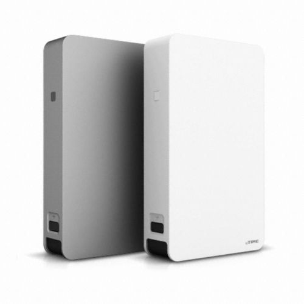

# 서론

외장하드 기능을 보다보면 간혹 `UAS` 혹은 `UASP`라고 불리는 기능이 있다. USB Attached SCSI 라는놈인데 이름 그대로 SCSI 기술을 USB를 통해 사용하겠다는건데

왜 USB를 그냥 USB로 안쓰고 이렇게 번거롭게 SCSI명령어로 바꾼다음에 보내냐면 이게 더 빠르기 때문이다. 

 정확히는 SCSI의 경우 별도의 컨트롤러가 명령어를 하드웨어레벨로 처리하기때문에 CPU가 데이터를 USB명령어에 맞게 인코드해서 보내줄필요 없이 CPU는 그냥 데이터를 메모리상에 올려두기만 하면 나머지는 컨트롤러가 알아서 외부 디바이스로 보내주기땜에 CPU로드가 훨씬 적고 거의 대부분의 경우 병목현상이 없기때문에 훨씬 빠르다. (SATA레벨은 아닌 모양이지만)
 
 물론 단점도 존재한다. 필자는 얼마전 서버를 ODROID N2로 바꾸었고 기존 3.5인치 하드디스크를 사용하기위해 `EFM iptime HDD 3135` 를 구입했는데
 
 
 
 문제는 이놈이 UAS를 지원을 하는데 10분마다 자동으로 절전모드에 들어가면서, HDD스핀을 멈춘 절전모드에서 다시 활성화 시키는 그 시간을 ODROID가 기다리지 못하고 Timing Error를 뿜뿜해버리고 수동으로 USB를 뽑았다가 다시 꼽을때까지 못쓰게 된다는 것이다.
 
 ~~말은 쉽지만 찾아내는데 한참 걸렸다.~~
 
 이 문제를 어찌어찌 해결하고나니 또 생긴 문제가, ODROID N2가 아직 나온지 얼마 안된 파릇파릇한 놈이라서 UAS가 완전하지 못하다...... 포럼가보니깐 여기저기서 비명소리가 들려오고 필자도 20~30GB되는 파일 전송할때 꼭 80~90%정도 성공했을때 오류나면서 죽어버리는거 4번 경험 + 12시간도 안되서 어느순간 하드 연결 해제되는거 보고 빡쳐서 결국 UAS를 죽이고 그냥 평범하게 USB-Storage로 사용하기로 결심했다.
 
 단점은 위에서 말한대로 CPU점유율이 좀 많이 올라가고(30~40% 정도), 이더넷으로 전송기준 100MB/s 나오던게 80MB/s 최대로 확 느려진다.
 
 장점은 무진장 안정적이게 된다.
 
# 시작하기전에
 보통 구글 검색해보면 modprobe에서 blacklist에 uas를 추가시켜서 비활성화 시키는 방법을 알게될것이다.
 
 문제는 보통 이걸로 비활성화가 가능하면 UASP를 사용하기에 별 문제 없을 확률이 높다. 그러므로 이 방법은 Pass
 
# 본론
일단 외장하드가 어떤 드라이버로 연결되어있는지 확인이 필요하다.

`lsusb -t`

를 실행해보면 인식된 USB장치들이 포트별로 보이게 된다.

    /:  Bus 02.Port 1: Dev 1, Class=root_hub, Driver=xhci-hcd/1p, 5000M
        |__ Port 1: Dev 2, If 0, Class=Hub, Driver=hub/4p, 5000M
            |__ Port 2: Dev 3, If 0, Class=Mass Storage, Driver=uas, 5000M
    /:  Bus 01.Port 1: Dev 1, Class=root_hub, Driver=xhci-hcd/2p, 480M
        |__ Port 1: Dev 2, If 0, Class=Hub, Driver=hub/4p, 480M
            |__ Port 1: Dev 3, If 0, Class=Mass Storage, Driver=usb-storage, 480M
            
여기서 Bus 02, Dev 3에 존재하는 문제의 장비를 보면 Driver 가 `uas`로 설정된것을 확인할 수 있다.

여기서 `lsusb`를 실행시켜보면

    Bus 002 Device 001: ID 1d6b:0003 Linux Foundation 3.0 root hub
    Bus 001 Device 003: ID 152d:2329 JMicron Technology Corp. / JMicron USA Technology Corp. JM20329 SATA Bridge
    Bus 001 Device 002: ID 05e3:0610 Genesys Logic, Inc. 4-port hub
    Bus 001 Device 001: ID 1d6b:0002 Linux Foundation 2.0 root hub
    
`Bus 002 Device 003`는 `VIA Labs`에서 만든 칩을 사용하며 VID:PID는 `2109:0711` 임을 알 수 있다. (전자는 Vendor ID, 후자는 Product ID)

그럼 이제부터 할 일은 리눅스 Kernel에서 지원하는 `usb-storage.quirks` 기능을 사용해서 특정 디바이스에 한해 `uas`기능을 비활성화 하는것이다.

Odroid N2 내부에서 직접 `/media/boot/boot.ini` 를 수정하던가, 아님 윈도우에 emmc 꽂으면 유일하게 열리는 창에서 `boot.ini`를 메모장으로 수정하던가 해서

    setenv bootargs "root=UUID=e139ce78-9841-40fe-8823-96a304a09859 rootwait rw ${condev} ${amlogic} no_console_suspend fsck.repair=yes net.ifnames=0 elevator=noop hdmimode=${hdmimode} cvbsmode=576cvbs max_freq_a53=${max_freq_a53} max_freq_a73=${max_freq_a73} maxcpus=${maxcpus} voutmode=${voutmode} ${cmode} disablehpd=${disablehpd} cvbscable=${cvbscable} overscan=${overscan} ${hid_quirks} "
이 줄 맨 뒤에부분에 `usb-storage.quirks=2109:0711:u` 를 추가시켜주자.

2109는 각자의 VID로, 0711은 각자의 PID로 교체하고, u는 그대로 냅두면 된다. 별도의 옵션은 다음과 같다.

	usb-storage.quirks=
			[UMS] A list of quirks entries to supplement or
			override the built-in unusual_devs list.  List
			entries are separated by commas.  Each entry has
			the form VID:PID:Flags where VID and PID are Vendor
			and Product ID values (4-digit hex numbers) and
			Flags is a set of characters, each corresponding
			to a common usb-storage quirk flag as follows:
				a = SANE_SENSE (collect more than 18 bytes
					of sense data);
				b = BAD_SENSE (don't collect more than 18
					bytes of sense data);
				c = FIX_CAPACITY (decrease the reported
					device capacity by one sector);
				d = NO_READ_DISC_INFO (don't use
					READ_DISC_INFO command);
				e = NO_READ_CAPACITY_16 (don't use
					READ_CAPACITY_16 command);
				f = NO_REPORT_OPCODES (don't use report opcodes
					command, uas only);
				g = MAX_SECTORS_240 (don't transfer more than
					240 sectors at a time, uas only);
				h = CAPACITY_HEURISTICS (decrease the
					reported device capacity by one
					sector if the number is odd);
				i = IGNORE_DEVICE (don't bind to this
					device);
				j = NO_REPORT_LUNS (don't use report luns
					command, uas only);
				l = NOT_LOCKABLE (don't try to lock and
					unlock ejectable media);
				m = MAX_SECTORS_64 (don't transfer more
					than 64 sectors = 32 KB at a time);
				n = INITIAL_READ10 (force a retry of the
					initial READ(10) command);
				o = CAPACITY_OK (accept the capacity
					reported by the device);
				p = WRITE_CACHE (the device cache is ON
					by default);
				r = IGNORE_RESIDUE (the device reports
					bogus residue values);
				s = SINGLE_LUN (the device has only one
					Logical Unit);
				t = NO_ATA_1X (don't allow ATA(12) and ATA(16)
					commands, uas only);
				u = IGNORE_UAS (don't bind to the uas driver);
				w = NO_WP_DETECT (don't test whether the
					medium is write-protected).
				y = ALWAYS_SYNC (issue a SYNCHRONIZE_CACHE
					even if the device claims no cache)
			Example: quirks=0419:aaf5:rl,0421:0433:rc
            
추가하고나면 다음과 같은 모습이 되어있을것이다.

    setenv bootargs "root=UUID=e139ce78-9841-40fe-8823-96a304a09859 rootwait rw ${condev} ${amlogic} no_console_suspend fsck.repair=yes net.ifnames=0 elevator=noop hdmimode=${hdmimode} cvbsmode=576cvbs max_freq_a53=${max_freq_a53} max_freq_a73=${max_freq_a73} maxcpus=${maxcpus} voutmode=${voutmode} ${cmode} disablehpd=${disablehpd} cvbscable=${cvbscable} overscan=${overscan} ${hid_quirks} usb-storage.quirks=2109:0711:u"
    
이제 재부팅을 하고나면

    /:  Bus 02.Port 1: Dev 1, Class=root_hub, Driver=xhci-hcd/1p, 5000M
        |__ Port 1: Dev 2, If 0, Class=Hub, Driver=hub/4p, 5000M
            |__ Port 2: Dev 3, If 0, Class=Mass Storage, Driver=usb-storage, 5000M
    /:  Bus 01.Port 1: Dev 1, Class=root_hub, Driver=xhci-hcd/2p, 480M
        |__ Port 1: Dev 2, If 0, Class=Hub, Driver=hub/4p, 480M
            |__ Port 1: Dev 3, If 0, Class=Mass Storage, Driver=usb-storage, 480M

Bus02, Dev3이 uas가 아닌 usb-storage로 연결되어있는것을 확인할 수 있다.

(그리고 이제 파일전송해보면 높은 CPU 점유율과 함께 N2가 따끈따끈해지는걸 느끼게 될것이다.)

# 결론
 이번 문제 해결하기 정말 힘들었다. 
 
 Odroid N2는 정말 성능도 끝내주고, 소비전력도 엄청 적고, 생긴것도 나름 괜찮고, 소음도 없고 하드웨어적으로는 정말 끝내주는 놈이다. 
 
 하지만 나온지 얼마 안된놈이다. 안되는게 너무 많다. 심지어 Docker 돌리는데도 가끔 알수없는 에러가 난다......... 이래서 서버는 안정성이 검증된놈을 쓰는구나.... 라는걸 절실하게 깨달았다......
 
 생각해보면 XU3가 막 나왔을 때에도 그랬던거 같다. 근데 요즘은 안되는게 없는거 보면 (ARM에서 KVM돌리는건 처음본다.) 이놈도 괜찮아질꺼 같기는 한데 문제는 지금 당장이 좀 불안불안 하다는 것이다.
 
 일단 지금은 어떻게든 안정적인 세팅을 완료했으니 당분간 방치해둬야겠다.