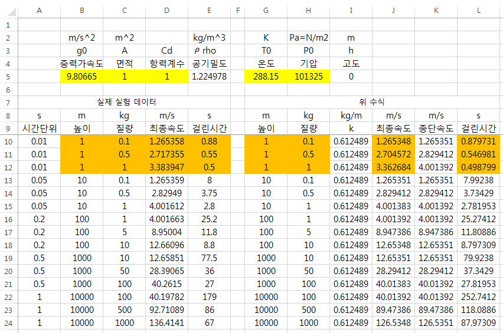

    k는 현재의 공기저항 상수
    s는 거리
    v는 속도
    a는 가속도
    F는 힘
    g는 중력가속도

공기저항은 속도 제곱에 비례하다는 가정하에 다음과 같은 결과가 나온다.

$$F\quad =\quad ma\quad =\quad mg-k{ v }_{  }^{ 2 }$$

$$a\quad =\quad \frac { mg\quad -\quad k{ v }^{ 2 } }{ m } \quad =\quad g-\frac { k{ v }^{ 2 } }{ m } \quad =\frac { dv }{ dt } $$

$$dv\quad =\quad (g-\frac { kv }{ m } )dt$$

$$\int { \frac { 1 }{ g-\frac { k{ v }^{ 2 } }{ m }  } dv } \quad =\int { dt } $$

$$\sqrt { \frac { m }{ gk }  } \tanh ^{ -1 }{ (\frac { v\sqrt { k }  }{ \sqrt { gk }  } ) } \quad =\quad t$$

$$v\quad =\quad \sqrt { \frac { gm }{ k }  } tanh(\frac { t\sqrt { gk }  }{ \sqrt { m }  } )$$

$$s\quad =\quad \int { v\quad dt } \quad =\quad \int { \sqrt { \frac { gm }{ k }  } tanh(\frac { t\sqrt { gk }  }{ \sqrt { m }  } ) } dt\quad \\\ =\quad \frac { m }{ k } log(cosh(t\sqrt { \frac { gk }{ m }  } ))$$

이 식은 위 데이터차트와 같이 높이가 낮은부분에 한해서 매우 정확하다.

하지만 고도가 높아질수록 공기밀도에 변화가 생겨 위에서 k로 잡은 상수가 변수가 되버리고

이는 곧 오차로 나타나 버린다.

-위 수식은 LaTeX로 작성됨-

-그전에 LaTeX를 쓰기위해 이 수식을 유도함-