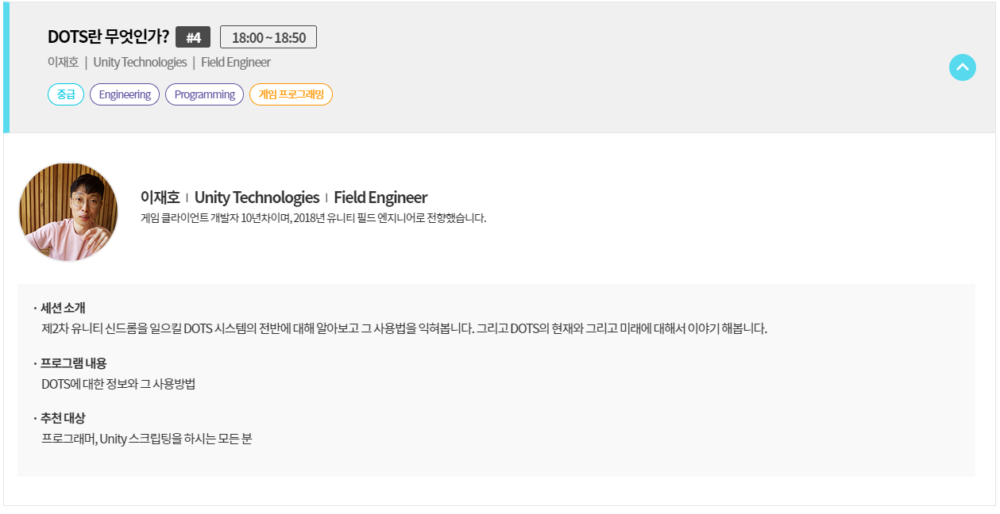
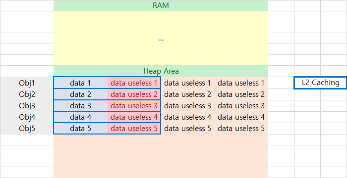
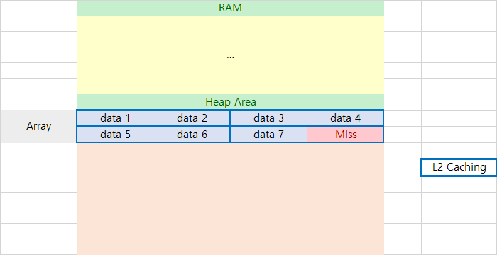

# 서론
 필자는 원래 게임을 별로 즐겨하는 성격이 아니기에 Unity에 별 관심이 없었다.

 데이터 시각화 수단으로써 잠깐 관심을 가졌던적이 있긴 하지만 그것도 잠시 훌륭한 Javascript 라이브러리들이 무식하게 커다란 데이터도 효율적으로, 구현하기 쉽게 시각화 수단을 제공하면서 이에대한 관심도 금방 사라졌다. (아무래도 Unity는 Restful한게 기본은 아니기에....)

 그렇게 관심이 없어지면서 2018년까지 필자의 Unity에 대한 생각은

     싱글스레드로 무식하게 물리연산해가면서 컴퓨터 리소스 우걱우걱 처먹고 틈만나면 램 처묵처묵하면서 버그 내뿜는 이상한 놈이지만 공짜에다 개발이 편해서 게임 개발자들에게 사랑받는 존재.

 뭐 이정도 였다.

 그러다 생각이 바뀐게 유튜브에서 추천영상으로 유니티 Keynote가 뜨길레 심심해서 봤더니만 여전히 램은 좀 처묵처묵하고 버그도 좀 있어보이지만 엄청난 스폰서를 뒤에두고 연산효율이 이전버전대비 비상식적으로 올라간 새로운 존재로 탈바꿈한걸 깨닫고나서 부터이다.

  그렇게 DOTS라는 존재가 이걸 가능하게 했다는건 알았지만 솔직히 Unity 쓸일이 없기에 자세히 알아보진 않았었는데 이번에 `Unite Seoul 2019`에 참석하면서 DOTS에 대해 설명을 듣는시간이 있었는데 설명을 듣고나니 뭔가 통쾌하게 이해가 되서 그 기쁨을 나누고자 이 글을 써본다.

  

  참고로 설명해주신분은 Unity 에서 Field Engineer 로 일하고 계신 이재호 님이시다.
  ~~모든 Keynotes 중에서 가장 보람있었다고 생각하고 있다.~~

  ## 주의사항
   1. 필자는 DOTS에 반했을뿐 유니티는 깔아본적도 없다. 그래서 주로 이론적인 부분만 파고들 생각이다.
   2. 2019년 5월 현재 DOTS는 아직 대부분의 기능이 BETA 상태이다. 아마 이 글은 경험상 2019년 이후에도 계속 남게 될텐데 지금 기준으로 DOTS 기술이 적용된건 Physics관련된것들이 베타상태일 뿐이다. Rendering 부분은 아직 공개된것이 없고, Job system, Entity 같은것들도 매일매일 새로운 기능이 추가 삭제 수정되고 있는 상황이라고 한다. 기본적인 내용은 크게 안바뀌겠지만 참고 바란다.
   3. Unity의 DOTS는 수만개의 `GameObject`가 난무하는 상황에서 매우 효과적인 놈이다. 읽으면서 이 상황을 상상하면서 읽는것이 도움이 될것이다. 단일 `GameObject`상황에선 아마 더 성능이 떨어지겠지만 사실 게임에서 그런상황이 얼마나 있겠는가?

# Unity 뭐가 문제였나?
 필자가 즐겨했던 Unity 게임중에는 `Kerbal Space Program`이라는 게임이 있다. 사용자가 직접 로켓을 만들어 물리엔진을 이용해 현실에서 로켓날리는거랑 거의 똑같은 궤도역학을 통해 인공위성도 쏘고 수년걸려서 다른행성 갔다오기도 하는 매우 물리스러운 게임이었는데, 필자가 한창 즐겨했을때 이 게임은 Unity 4를 사용하고 있었고 베타버전이었긴 했지만 게임상 프로그램적인 문제가 아주 심각했었다.

 그 중 가장 큰 문제는 **모든 물리연산이 싱글스레드로 돌아간다.** 는 것이다.
    
 아래 동영상을 보면 알다싶이 KSP에서는 플레이어가 만든 로켓이 각 부품별로 별도의 Object로 존재해 각 부품마다 물리연산이 행해져야하지만, 유니티 엔진 특성상 하나의 스레드가 각각의 Object에 내제된 물리엔진을 포함한 기타로직들을 하나씩 순회하면서 연산하다보니 부품이 200 ~ 300개만 넘어가도 Windows에서 응답없음을 때려버리면서 끌려면 작업관리자를 실행해야 하는 결과를 불러왔다.

 `DOTS`에서는 `ECS`라는 데이터(Component) 관리 방식과 `Job System`이란 함수지향적 디자인을 택한 연산방식을 통하여 개발자로 하여끔 가이드라인만 맞추어 코딩하면 최적화된 멀티 스레드 프로그래밍의 세계를 열어주었고 여기에 `Burst Compiler`라는 그 어떤 코드적 추가작업없이 더 빠른 성능을 가져다주는 새로운 컴파일러를 추가해 위와 같이 CPU부하가 심한 작업의 경우 약 20배 가까운 퍼포먼스 향상을 가져와준다.
 ~~(문제는 아직 이 게임에는 적용되지 않았다.)~~

 그럼 이제 DOTS에 대해 알아보자.

<iframe width="560" height="315" src="https://www.youtube.com/embed/ONP9jS14toE" frameborder="0" allow="accelerometer; autoplay; clipboard-write; encrypted-media; gyroscope; picture-in-picture" allowfullscreen></iframe>

## 데이터 지향
 필자가 어릴때는 컴퓨터 프로그래밍론 하면 두가지만 생각하면 됬다. 

 1. 절차지향
 2. 객체지향

 참 편했던 세상이었지만 요즘은 좀 무섭다. 일단 `함수지향(Functional Programing)`개념이 부활했다. 그리고 이에 뒤따라 `함수반응형프로그래밍(FRP)`이 생겼다. 그리고 같은 비교군에 해당되는지는 미묘하지만 `MVC`패턴이 생겼고 이에 뒤따라 `MVVM`이니 `MVP`같은 것들도 생겼다. 이런 무서운 세상에 하나가 추가됬으니 그게 바로 `Data-Oriented Design(데이터지향 설계)`이다.

 `데이터 지향 설계`(이하 `DOD`)은 다른놈들과는 다르게 프로그래머로 하여끔 더 편한 코딩환경을 제공하기위한 구조가 아닌 **컴퓨터로 하여끔 더 편한 연산환경을 제공하기 위한 구조**이다. 좀더 구체적으로 들어가기 위해서는 CPU의 작동원리를 되새겨볼 필요가 있다.

 컴퓨터는 일반적으로 보조기억장치, 주기억장치, 그리고 `CPU`로 구성되어 있다. 일반적으로 보조기억장치는 `SSD`를 말하고 ~~(HDD가 뭐죠?)~~ 주 기억장치는 `RAM`을 말한다. 그럼 여기서 한번쯤 해보는 초보적인 질문이 "어차피 `SSD`에 데이터가 존재하는데 `CPU`에서 직접 꺼내다 쓰지 뭐하러 `RAM`에 옮겼다 쓰냐?" 라는 것이다. 답은 이미 모두가 알고있다. 반응속도 때문이다. 

 하지만 `CPU`입장에서는 `RAM`도 느리다. 그래서 만들어진게 `L1` `L2` 캐쉬이다. `CPU`속에 존재해서 `RAM`에서 꺼내온 정보를 초고속으로 연산장치에 넘기는 일을 한다. 여기서 한가지 아이디어가 제안되었는데, 필요할때마다 **필요한 정보만** `RAM`에서 정보를 `L2`캐쉬에 저장했다가 가져오는것도 **나름 빠르지만** 만약 **필요해 보이는 정보도** 같이 가져와서 넣어두면 **훨씬 빠르지 않을까?** 라는 생각이다.
 이러한 아이디어 실제로 꽤 실용성이 있는 생각이어서 요즘 `CPU`는 필요한 정보뿐만이 아닌 필요해 보이는 정보도 미리 가져와 캐쉬에 저장해둔다. 만약 이 데이터가 필요한거였다면 `CPU` 입장에선 도박에 성공해 훨씬 빠르게 일처리를 끝내는 것이고, 필요없는것 이였다면 `Cache Miss`라 불리며 도박에 실패하고 `RAM`에서 다음정보가 날라올때까지 노는수밖에 없게 되는것이다.

     가끔씩 어떤 작업을 실행하다보면 연산해야하는일은 산더미 같은데 작업관리자에서 CPU 점유율은 40% 밖에 안되는 경우를 본적 있을것이다. 이게 바로 `Cache Miss`가 일어났을때 일이다. CPU 점유율은 리눅스 기준으로 IDLE이 아닌 시간의 백분률, 즉 노는시간 빼고 다른시간의 비율을 현재 CPU의 점유율이라고 표시하는데, 일은 쌓여있는데 일을 안하는건(IDLE) `Cache Miss`가 일어나 일감이 `RAM`에만 존재하고 `Cache`에 존재 안했을때가 바로 이때인 것이다. 불쌍한 컴퓨터 구박하지 말고 `Cache Miss`가 일어나도록 프로그래밍한 프로그래머를 구박하자.

 하지만 CPU입장에서 다음에 필요한 정보를 예측하는건 꽤 어려운 문제이기에, CPU 입장에서 다음정보의 `RAM`상의 위치를 추론하기 쉽게 하자는 취지에서 나온게 바로 `DOD` `데이터 지향 디자인`이다.
 어떻게 위치추론을 쉽게 만드냐 묻는다면 별건 없다. 상식적으로 이번에 연산한 데이터 바로 다음에 다음에 연산할 데이터가 있으면 추론하기 쉽지 않겠는가? 그래서 `Array`하나에 연산에 사용할 데이터를 낭비없이 쑤셔넣으면 그게 바로 `DOD`가 되는것이다.

 `DOD`가 얼마나 효과적인지 `객체지향`프로그래밍과 비교해보자. `OOP`의 경우 일반적으로 모든 연산해야할 데이터가 `객체`속에 존재하고 각 `객체`는 `RAM`의 `Heap`영역에서 그냥 자리나는데로 들어가 저장한다. 그 결과는 다음과 같다.

 각 객체가 포함되어있는 정보가 연속적으로 저장되어있기에, 한번에 두칸씩 캐싱을 한다 할경우 연상에 필요한 `data 1~5`의 정보를 꺼내오기까지 총 5번의 `Cache Miss`가 발생하게 된다.

 반면 `DoD`의 경우 `객체지향`에서 각 객체에 들어갈 데이터를 종류별로 한데모아 하나의 `Array`에다가 저장을 한다. 이럴 경우 다음 그림과 같이 연산해야할 데이터는 `RAM` 안에서 모두 연속된 공간에 존재하게 된다.

단순히 저장방법만 바꿨을 뿐인데 `OOP`에서는 5번 캐싱으로 5개의 데이터를 불러올동안 `DOD`에서는 4번의 캐싱으로 총 7개의 데이터를 불러올 수 있게된다!

이렇듯 `DoD`가 `Cache Miss`를 줄여 더 빠른 연산속도를 끌어낸다는 것을 이론적으론 쉽게 알 수 있지만 구체적으로 이게 얼마나 큰 효과를 발휘하는지에 대해서는 다음 두 링크를 들어가 보는것을 추천한다.

[안드로이드 Data-Oriented Programing 실험](https://android-developers.googleblog.com/2015/07/game-performance-data-oriented.html)

[Voxel 렌더링에서 OOP와 DOD의 비교](http://knight666.com/blog/tutorial-a-practical-example-of-data-oriented-design/)

전자의 경우 단순 loop문을 통해 `Array`속 데이터를 꺼내오는 작업임에도 불구하고 `Cache Miss`를 통해 발생하는 성능차이를 보여주고

후자의 경우 별도의 최적화 없이 똑같은 작업을 OOP와 DOD로 나눠 코딩하고 그 둘을 비교해 성능의 차이를 보여준다. 만약 여기에 `SIMD`를 곁들이면 CPU 모델, 명령어 종류마다 다르지만 보통 3~8배 정도의 성능향상이 가능하다. `OOP`에도 SIMD 기능을 추가할 수는 있겠지만 SIMD 명령어를 쓰려면 결국 어떻게든 데이터를 연속적인 공간에 모아놔야되서 결국 `DOD`가 되버리니 참고 바란다. 

# Data-Oriented Technology Stack? 2
 그래서 `Data-Oriented Technology Stack`의 `Data-Oriented`의 개념은 알게 되었다. 단순히 객체의 데이터를 `Array`에 넣는것만으로도 성능 향상을 꽤할 수 있다는 것이다.

 `Technology`는 단순한 `Cache Miss`를 최소화 해서 성능효과를 얻는것 뿐만이 아닌 `SIMD` `Multi Threading`등의 기술을 활용해서, 즉 `DOD`에 맞는 최적화 작업을 통해 추가적인 성능을 얻을 수 있게하는 `Technology`를 의미한다.

 그럼 `Stack`, 즉 패키지, 기술들의 집합이라는 뜻인데 어떤 기술들이 숨어있을까? Unity에서 내세운건 다음 세가지 이다.

   1. C# Job System
   2. Entity Component System (ECS)
   3. Burst Compiler

 차근차근 설명해 주겠지만 미리 간단히 소개를 해보자면

 `Job System`과 `Entity Component System`은 유니티의 기존 `GameObject`를 대체하는 존재이다. 기존 `Game Object`에서는 각 객체의 데이터와 그에대한 처리로직을 한데모아 저장해놨다면 `DOTS`에서는 처리로직은 `Job System`이, 각 객체에대한 정보는 `Entity`가 가지고 있다.

 각 `Entity`에서 가지고 있는 정보는 `Entity Component System (이하 ECS)`에서 통괄적으로 관리하며 `Job System`이 데이터를 `ECS`에 요청하면 `ECS`는 데이터를 주고 `Job System`은 병렬적으로 연산을 행한뒤 결과를 다시 `ECS`돌려줘 데이터를 갱신한다.

 서버쪽으로 비유를 해보자면 `ECS`는 `Database`같은 존재이고 `Job System`은 `DB`에서 정보를 빼와 처리한뒤 `DB`를 갱신하는 클라이언트 적인 존재라고 할 수 있다.

 `Burst Compiler`는 `Mono`를 대체하는 존재이다. 본래 `Mono`가 `범용성`을 목적으로 만들어진 존재라 게임용으로는 성능이 그닥 좋은놈이 아닌지라 유니티에서 그냥 새로 만들었다.

 정도이다. 사실 이정도만 알아도 개발자입장에선 충분할 꺼 같지만, 이건 `원리부터 파악하는 DOTS` 이므로 원리를 조금 까볼려고 한다.

## Entity Component System (ECS)
 기존 유니티에서 가장 기본적인 요소는 바로 `GameObject`이다. `GameObject`는 화면상의 어떤 물체, 효과, 광원등의 정보를 담는 기본적인 단위라고 할수 있으며, `Object`란 단어가 포함된것에서 알수있다싶이, `OOP` 즉 객체지향적인 개념을 적용해 탄생한 용어이다.

 `GameObject`의 장점은 명확하다. 사람입장에서 프로그래밍하기 직관적이다. 하나의 `GameObject`가 어떤 캐릭터를 정의한다면 이 캐릭터에 대한 광원효과, 움직일시 취해야하는 애니메이션, 체력, 능력같은 수치들을 그냥 하나의 `Object`안에 저장하고 공격받을때, 특정 행동을 취할때 발생해야할 로직같은것들도 그냥 하나의 `Object`안에 정의만 해놓으면 나머진 Unity가 알아서 처리해준다.

 단점은 성능을 깍아먹고 최적화가 어렵다는 점이다. 일단 위의 `DOD`경우에서 `OOP`와의 비교만 보아도 `OOP`의 예측할수 없는 메모리 배치상황은 `Cache Miss`를 너무 잘 유발하고, 이는 곧 CPU가 놀고있는 상태를 너무 쉽게 유발한다. 아무리 컴퓨터 성능이 좋아졌다지만 `1 fps`가 아쉬운 게임에서는 이는 곧 낭비였다.

 근데 여기에 더 큰 문제가 있었으니, 이러한 객체화로인한 메모리상의 파편화는 범용성을 지향하는 `Unity`입장에서는 **일반적인** 최적화가 사실상 불가능하다는 것이다. 모든 각각의 `Object`에서 고유의 처리알고리즘을 가지고 서로간의 의존성(Dependency)도 제대로 명시되지 않은 기존의 시스템에서는 개발자가 의도한 알고리즘을 보장하기 위해서 `SIMD`같은 `CPU Instruction`수준에서의 병렬처리는 대규모 연산이 아닌 하나의 `Object`안에서의 소규모 연산으로 한정되었고, 멀티스레드를 사용한 멀티코어 연산은 유니티 사용저가 직접 개발하지 않으면 쓸수가 없었다.
  이는 좀 쉽게말하면 요즘 8코어 16스레드 컴퓨터가 난무하고, 나날이 병렬연산에 최적화된 CPU 명령어가 새로 출시되는 요즘 세상에서, **싱글코어 싱글스레드 연산**이 기본옵션이고 **새로나온 CPU명령어는 거의 사용도 안한다는 것**이다.

  그러니 나온 해결책 첫 수단으로써 **연산에 필요한 데이터"만" 모아서 `Array`화 시켜주는 존재**가 바로 `ECS`이다.

 일단 데이터를 `Array`로 모아주는것의 장점을 말하자면 당연하게도 `Cache Miss`의 경우를 획기적으로 줄여준다. 그냥 메모리상에서 연속적인 공간을 불러오기만해도 필요한 모든 데이터를 불러오는것이니 `Cache Miss`가 발생하지 않는다.
 또한 필요한 데이터**만**을 불러오는 과정이 이미 이 데이터들은 병렬적으로 처리될수 있음을 암시하는것이기 때문에 추후 Job System에서 언급하겠지만 병렬연산이 무진장 쉬워진다.

 그럼 `ECS`는 어떻게 작동할까?

 `ECS`는 이름에 나와있는것처럼 3가지 구성요소로 구성되어있다. `Entity`, `Component`, `System`. 먼저 `Component`는 기존 유니티에서 사용되는 개념이랑 같은건데 좀 프로그래밍관점에서 말하면 3차원 공간에서의 좌표라던지 광원의 세기와 같은 실질적인 수치를 가지고있는 데이터이다. 이는 `ECS`에서 인출 가능한 최소단위의 데이터이기도 한데 이러한 `Component`를 모아놓은게 `Entity`이다. 

  `Entity`는 기존의 `GameObject`에서 로직부분은 버리고 데이터만 모아놓은거라고 봐도 무방하다. 유니티에서는 하위호환을 위해 `GameObject`를 `Entity`화 해주는 함수를 만들어 놓았는데 실질적으로 하는일은 `GameObject`가 가지고 있는 `Component`들을 `Entity`규격에 맞게 새로 배치하는 것 뿐이니 얼마나 `GameObjet`와 유사한지 짐작할 수 있을것이다.

  `System`은 이러한 `Entity`들을 관리하는 역할을 한다. `System`이 `Entity`를 관리하는 방법은 대충 다음과 같다.

  1. 같은 종류의 `Component`를 가진 `Entity`들 끼리 뭉쳐 `Archetype` 이란 이름을 붙혀준다.
  2. 같은 `Archetype`를 가진 `Entity`들을 뭉쳐서 16KB 단위로 메모리 상에 저장한다.
  3. `Job System`에서 `Entity`가 가진 어떤 종류의 `Component` 뭉치를 요청하면 해당 조건을 만족하는 `Array`를 새로 만들어서 넘겨준다.
  4. `Job System`이 연산결과를 돌려주면 갱신해준다.

 1번의 이유는 일단 규격을 통일시키기 위해서이다. `Component`가 `int`나 `float`같은 숫자 데이터 위주로 구성되어 정적인 크기를 가졌으니, 같은 종류의 `Component`로만 구성되어진 `Entity`또한 정적인 정해진 크기를 가지게 됨으로 이를 `Archetype`이란 이름하에 규격화 시키는 것이다. ~~(라곤 말했지만 프로그래머가 Archetype을 직접 정의해 줘야한다.~~

 2번은 이렇게 규격화된 `Entity`를 메모리상에 올려두는 작업이다. `Entity`의 크기가 고정되어 있으므로 **"모든 Entity 에서 1번 Component 불러와!"** 라는 작업을 할 경우 C++에서 포인터에 고정된 값만 더해가면서 정보를 읽어오는 작업만 해주면 되는 장점이 있다. 16KB단위로 쪼개는 이유는 큰 연속된 공간을 메모리상에 점유하면 메모리 유연성이 떨어지기 때문인데 컴퓨터 자료구조를 배웠다면 이정도면 충분히 이해할 것이라 믿는다. 

 3번은 모든 `Entity`에서 특정 `Component`만 모아 하나의 `Array`로 복제하는 과정이다. 이렇게 함으로써 유니티는 `OOP`라는 프로그래머 관점의 편리함과 `DOD`라는 컴퓨터 관점의 최적화를 성취해 냈을뿐만이 더 쉬운 멀티스레드를 프로그래밍을 가능하게 했다.

 4번은 3번과정의 역과정이다. 1번에서 `Entity`의 규격을 통일시켜 놨기에 C++에서 인덱스값만 특정수만큼 증가시켜가면서 입력만 하면되는 아주 간단하고 빠른 작업이다.

 이게 바로 `ECS`이다. 가장 Simple한게 가장 Powerful 하다는 말처럼 복잡해 보이지만 실은 아주 단순한 구조로 이루어져 빠른 속도를 자랑하는것이 개인적으로는 매우 맘에드는 구조이다. ㅎ

# C# Job System
 `ECS`가 데이터를 관리해주는 존재라면 `Job System`은 `ECS`로부터 데이터를 넘겨받아 실질적인 연산을 행하는 존재이다. 이놈도 `ECS`처럼 이름이 구성요소인데 `Job`과 `System`으로 구성되어 있다.

 `Job`은 일이다. 어떤 `Entity`의 어떤 `Component` 데이터가 입력으로 들어왔을때 어떤일을 행하면 되며 그 결과 어떤 값이 수정되어져야 하는가? 를 정의하는 부분이다. 좀 쉽게 이해하자면 `함수지향`에서 `함수`와 같은놈이다. 내부상태를 가지지 않으며 같은 입력에 대해서는 언제나 같은 결과를 가진다는게 특징이다.

 `System`은 `Job`에서 필요로 하는 데이터를 `ECS`로 부터 가져오고, 현재 CPU에 최적화된 개수만큼의 `Job`을 동시에 실행시킨 뒤 결과값을 다시 `ECS`에 돌려주는 역할을 한다. 또 부가적으로 `Job`간의 실행 타이밍을 결정해 주기도 한다. 현재로서는 `jobA`는 `jobB` 다음에 실행하라! 정도의 선택지만 가능하지만 추가될 예정이라고 Keynotes에서 들었으니 기대해볼만 하다 생각된다.

 그럼 이게 어떻게 병렬화에 유리한지 물리엔진을 구현하는 경우를 생각해보자. 여기서 생각하는 물리엔진은 다음과 5만개의 객체에 대해 다음과 같이 간단한 연산을 행한다.

    1. 각 객체에서 가속도값을 불러와 속도값을 갱신한다.
    2. 각 객체에서 속도값을 불러와 위치값을 갱신한다.

 기존 유니티의 경우 하나의 스레드가 5만개의 객체를 하나씩 들어가면서 하나씩 1,2의 연산을 행한 뒤 데이터를 갱신해가는 구조였다. 물론 5만개의 객체를 동시에 실행해도 되지만 여기서 문제가 되는게 `Race Condition`이다. 여기서는 어떤 객체가 다른객체에 영향을 주지 않으니 상관 없지만 `Unity`입장에서는 그걸 확인할 수 없다. 그리고 만약 A객체의 연산과정이 B객체에 영향을 줄 경우 B객체에서 연산을 행하는 도중 A객체 연산 스레드가 B의 메모리값을 변경할 경우 프로그래머 입장에서는 추적할 수 없는 오류가 발생하게 된다.

 하지만 `Job System`에서는 이러한 경우가 원천 차단된다. 일단 `Job`에게 주어지는 데이터 자체가 `ECS`에서 필요한 데이터만을 골라주었기 때문에 자기 객체 고유의 것으로 제한이된다. 어떻게든 `Job`형태로 구현이 완료되었다는것은 암묵적으로 모든 연산이 병렬적으로 처리되도 괜찮다는 의미를 가지게되기 때문에 `Unity`입장에서는 마음놓고 모든 작업을 병렬적으로 처리할 수 있게된다.

 그럼 `Job System`에서 어떤 객체가 다른 객체에 영향을 주는 연산을 행해야할땐 어떻게 해야할까? 이는 상황마다 다르게 대처해야한다. 예를들어 물리연산 과정에

    3. 객체간 충돌이 발생할 경우 두 객체의 위치를 참조하여 속도를 반대값으로 바꿔준다.

 를 추가한다 생각해보자. 여기서 Unity Forum에서 내온답은 다음과 같다.

    두 객체가 충돌할때 이벤트를 발생시켜 Job과정과는 별개로 속도값을 바꿔준다.
    
    Job 과정에서 서로 충돌중인 두 객체를 확인한후 이들에게 특별한 Flag를 표시한 후 Flag가 표시된 객체들만을 모아서 새로운 Job을 실행시킨다.

 이렇듯 일반적인 해결책이 존재하지는 않고 Case by Case로 자신의 상황에 맞게 새로운 방법을 만들어야 한다는게 단점이라면 단점이다. 

 `Job System`을 사용할때 주의해야할 점은 `Job`을 정의한다고 그게 자동으로 실행되지 않는다는 점이다. 언제나 `Schedule` 함수를 통해 `예약`을 잡아두면 `System`이 그 `Job`을 해치운다는 느낌이다. 이러한 구조를 통해 `Job`을 실행시킬지 안시킬지를 유연하게 설정할 수 있다.

# Burst Compiler
 유니티가 사용하는 스크립트 언어인 C#은 현재 마이크로소프트에서 개발한 .Net Framework와 C#을 플랫폼을 가리지 않고 실행하기위한 프로젝트인 Mono, 이 두가지 환경에서 실행가능하다. 유니티의 경우 다양한 플랫폼을 지원하기 위해 Mono를 채택했지만 사실 Mono가 멀티 플랫폼을 지향하는놈이라서 성능은 조금 안좋은 편이다.

 하지만 1fps가 아쉬운 게임세상에서 아쉬운 성능의 컴파일러는 누가봐도 손해니 컴파일러를 손보자! 라는 생각에서 나온게 Burst Compiler이다. 자세한 정보는 너무 전문적인 분야라 본인도 자세히는 모르겠지만 게이밍 연산에 최적화 되어있어 단순히 컴파일러를 Burst Compiler로 선택하는 것 만으로도 10~15% 정도의 성능상 이득을 취할 수 있다고 한다.

 이 Burst Compiler를 제대로 사용하기 위해 유니티에서는 몇가지 라이브러리를 추가했는데 대표적인게 `Unity.Mathematics` 이다. 적혀있기론 이 라이브러리를 사용하면 CPU 레지스터 단위로 `SIMD`를 사용할 수 있다고 한다. 위에서 밝혔다 싶이 `SIMD`는 단순 연산대비 3~8배 정도의 성능향상을 가져오다는 점을 생각할때 쓰기는 조금 복잡해도 쓰는게 권장된다 생각한다.

# 마무리
 필자는 유니티를 깔아본적도 없는게 함정이지만 유니티의 새로운 혁신인 DOTS에 대해 알아보았다. 

 기존의 패러다임과(OOP)는 좀 많이 달라 유니티계 고인물들이 익숙치 않다는게 좀 문제지만 개인적으로 DOTS에서 제시하는 프로그래밍 가이드라인을 따라가다보면 성능상의 이득뿐만이 아닌 큰 규모의 프로젝트에서 코드의 가독성을 높여줄꺼라 확신한다. 

 확신하는 이유는 경험이다. 비록 게임분야는 입문도 안해봤지만 머신러닝하면서 익혀본 노가다 계산 영역에서는 이렇게 Data Fetch 부분과 Proccessing 부분을 나눠두면 작은규모에선 짜증나도 큰큐모로 가면 직관성이 높아지고, MongoDB에 저장되어있는 데이터처럼 모든 객체가 대체적으로는 유사하지만 자유로운 형태를 가지는 데이터를 가지고 놀때도 새로운 Type을 정의해줄 필요가 없어 꽤 유용하다. ~~(여러분 샘플링 데이터는 일정한 규격을 가진걸 고릅시다!)~~

 물론 장점만 있는것은 아닐 것이다. 하지만 일단 지금 당장은 그 단점이 뭔지 모르겠다. 

 실제 이러한 디자인으로 개발을 시작하면 뭔가 안좋은점이 나타날지도 모르겠지만, 객체지향의 형식을 가지고(Entity) 병렬화를 가능하게 하며(Job) Low-Level 최적화를 통해 성능을 이끌어낸(Burst Compiler) DOTS를 아직(2019년 5월) 미완성이라서 안쓰고 있다는 이유를 제외하고 다른 이유로 안쓴다는것은 손해라고 생각한다.