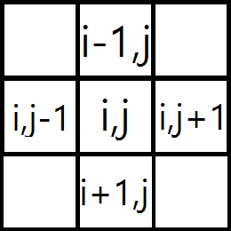
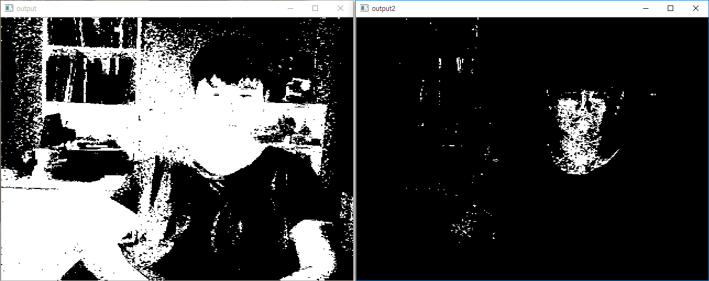

### 서론
OpenCV에 대해 포스팅되는 글들에대해 개인적으로 분류를 해보자면 크게 두가지 부류가 있다.
하나는 "**나도 이게 어떻게 되는지는 모르지만 일단 되는류**" 고 나머지 하나는 "**난 이미 너무 자세히 알고있어서 기초에대해 포스팅할 마음이 안생기는류**"이다.

이것이 진실로 그러하든 그러하지않던 초보자에게 한글로된 문서만 보고 OpenCV입문이란 힘든다는것은 아마 대부분의 사람들이 공감할것이라 믿는다.

그래서 비교적 최신버전(3.0)에 기초하여 OpenCV가 사용하는 기본적인 함수부터 개발자가 이러한 함수를 만든 의도까지 살려서 **C++** 혹은 **객체지향언어의 본질**을 깨달은 사람을 대상으로 **"이정도 이해했으면 나머지는 알아서 할수있겠지!"** 정도까지 글을 적어보려고 한다.

이 글은 시간이 날때마다 업데이트되며 이 블로그에서 OpenCV에대한 튜토리얼은 이 글 하나로 끝낼 생각이다.

또한 어느정도 주관이 들어가고 본인도 완벽히 이해하지 못하는 내용에대해서는 추측으로 글을 쓸수도 있기에 틀린내용이 있으면 댓글로 남겨주길 바란다.

설치에 대한 글은 따로 적지 않겠다. 윈도우 환경이라면 개인적으로 [이 글](http://webnautes.tistory.com/673)을 추천한다.

### 소개
OpenCV는 인텔의 후원을 받으며 다음과 같은 목표를 가지고 있다.

>Advance vision research by providing not only open but also optimized code for basic vision infrastructure. No more reinventing the wheel.

>Disseminate vision knowledge by providing a common infrastructure that developers could build on, so that code would be more readily readable and transferable.

>Advance vision-based commercial applications by making portable, performance-optimized code available for free—with a license that did not require to be open or free themselves.

영어 울렁증인 분들을 위해 번역해 보자면

> 오픈되있고 기초적인 영상처리에대한 최적화된 코드를 제공해 쓸데없는 시간낭비를 줄임으로서 진보된 영상처리 연구일것.

> 개발자들이 쓸수있고 일반화되서 다른 개발자들이 이해할수 있고 변형가능하게 함으로서 영상처리에관한 지식을 퍼뜨릴것.

> 대충 누구나 쓸수있고 코드를 꼭 공개하지 않아도 되게할것 (라이센스 관련 이야기 입니다.)

이것이 OpenCV의 기본 모토이며 실제로 잘 지키고 있으며 OpenCV자체 소개글에 의하면 2500개가 넘는 영상처리 관련 알고리즘이 최적화되서 포함되 있다고 한다.

즉, 요약하자면 우리는 복잡한 영상처리 알고리즘들을 완벽히 구현해낼 필요없이 OpenCV에서 제공하는걸 가져다 쓰면 되고, 또 이것들은 세계에 존재하는 우리만큼 (혹은 우리보다) 똑똑한 사람들이 "이것"에만 집중해서 만들어져 엄청난 최적화와 뛰어난 메모리관리가 가능한 라이브러리들의 집합체 라는것이다.

참고로 말하자면 상황에따라 개인이 집적 코딩하는게 더 효율적인 순간도 있겠지만 어지간해서는 알고리즘에대한 기초적인 이해만 가지고 OpenCV를 사용해 코딩하는게 생산성도 높고 결과물도 더 빠르다.

### Mat -기초적인 이미지 저장소

1. 기초
OpenCV자체가 영상처리에 관해 다루는 라이브러리인 만큼 "영상", 즉 "이미지"에 대한 데이터가 저장될 장소가 일단 필요하다. OpenCV에서는 이 저장소를 `Mat`이라 한다. (Matrix의 앞글자만 따온것이다)*(실제 Mat은 이미지 저장소로도 쓰이지만 행렬식으로써의 사용도 가능하다. 추후언급)*

        구버전을 기준으로 OpenCV를 접하신 분들은 아마 `IplImage`의 존재를 아시는 분이 있을것이다. 둘다 이미지를 저장하고 관리하는건 같으나 다른점이 있다면 `IplImage`는 수동으로 메모리 배치와 해체를 해줌으로서 메모리 관리를 해줘야 한다면 `Mat`은 하나의 객체, 즉 `Class`로서 자체적으로 메모리관리가 가능하다는 것이다.
        물론 `IplImage`의 존재가 사라진것은 아니며 그대로 쓸수있긴 하지만 OpenCV 개발자쪽에서도 이건 권장하지 않으며 프로젝트가 방대해짐에따라 메모리관리의 지옥에 빠지기 싫다면 `Mat`을 사용하도록 하자.

 `Mat`은 이미지를 저장하는 하나의 `class`이며 이것은 크게 `헤더`와 `데이터 포인터`로 구성되어 있다.

 `헤더`는 자기 자신에 저장되있는 이미지에 대한 정보를 담는 곳이다. 예를들면 "이미지 크기", "이미지 포맷"같은것들 말이다. 그리고 `데이터 포인터`는 **이미지 하나하나의 픽셀**이 담겨있는 **메모리 주소**에대한 정보를 가지고 있는 곳이다.

 이 두가지 부류의 정보가 담겨있는 `Mat`은 다음과 같이 사용가능하다.

```c++
Mat A, C;                          // Mat클래스 A와 C를 선언
A = imread("a.jpg", IMREAD_COLOR); // imread함수로 이미지"a.jpg"를 불러옴
Mat B(A);                          // B를 선언하고 A를 복사해옴
C = A;                             // C에 A를 대입함.
```

 근데 여기서 한가지 주의해야할 점이 있다.
일단 `imread`함수를 통해 `A`에 "헤더"와 "데이터 포인터"가 저장된것은 좋으나 `B`가 A로부터 정보를 복사해갈때 이역시 "헤더"와 "데이터 포인터"만 복사가 되지 "이미지 데이터"그 자체는 복사가 안된다. 이는 `C`역시도 마찬가지 인데 이 일로 인해 생길수 있는 현상은 **`C`의 이미지 데이터를 이진화 했는데 `A`의 데이터도 이진화 되버리고 `B`역시 같아졌다!**와 같은것을 초래할수 있다.

 이를 방지하기 위해

```c++
C = A.clone();
C.copyTo(A);
```

 와 같은식으로 **데이터를 통째로 복사**해오면 `C`가 변한다 해서 `A`가 변하지 않고 그 반대도 마찬가지느 참고하도록 하자.

2. 이미지 저장방법

 `Mat`은 위에서 말했다싶이 **Matrix**에서 따온 글자임으로 그 저장방법도 행렬처럼 저장이 된다.
 

 위 사진은 `BGR`*(RGB에서 순서만 바뀜)*형식의 이미지가 메모리상에 저장되는 방법이다. 보다싶이 한 픽셀에 **"파랑","초록",빨강"**이 순서대로 저장되 있다. 

 이건 메모리 주소상으로도 마찬가지이며 만약 어떤 포인터 `ptr`이 **(x=12,y=15) 픽셀의 파란색**을 가리키고 있다면 `ptr++`를 해주면 그 다음위치인 **(x=12,y=15) 픽셀의 초록색**을 가리키게 되는 구조이다.

 OpenCV에서는 이런 **"파랑","초록",빨강"**같은걸 **채널**이라 부른다. 이경우 채널수는 3개가 되며 이 형식은 이미지의 포맷별로 다르며 임의로 자신이 구성할수도 있다.

 참고로 `OpenCV`가 지원하는 이미지 포맷은 크게 4가지 정도가 있다.
  1. RGB : 우리가 잘 알고있고 흔히 쓰는방법이다. 각 픽셀별로 `빨강`,`초록`,`파랑`을 0~255사이의 숫자로 색을 표현하는 것이다. 주의해야할 점은 OpenCV는 RGB대신 BGR(순서만 바꿈)형식으로 데이터를 저장하니 참고해 두자.
  2. [HSV, HLS](https://ko.wikipedia.org/wiki/HSV_%EC%83%89_%EA%B3%B5%EA%B0%84) : 둘다 같은것으로 색상**Hue**, 채도**Saturation**, 휘도(밝기)**Value(luminance)**로 색을 표현한다. 밝기에따라 색이 달라지는 RGB와 다르게 마지막 성질만 제외하면 비교적 일정한 데이터를 얻을수 있어서 영상처리분야에 애용되는 포맷이다.
  3. YCrCb : jpg에서 일반적으로 쓰이는 포맷이다. 
  4. CIE L*a*b* : [위키피디아](https://ko.wikipedia.org/wiki/Lab_%EC%83%89_%EA%B3%B5%EA%B0%84)

3. 초기화
 `Mat`에 이미지를 넣지 않고도 그냥 초기화 하는법도 있다.

    ```c++
    Mat M(2,2, CV_8UC3, Scalar(0,0,255));
    ```

  순서대로 **"행", "열", "초기화 타입", "초기화 내용"**으로 구성되며 초기화 타입의 경우 **CV_(하나의 데이터당 비트수)(Signed 인지 Unsigned 인지)C(채널수)**와 같은 형식을 가진다. 위 예제의경우 **데이터당 8비트의 저장공간을 가지고, Unsigned 형태로, 3가지 채널(RGB)를 가진다**라는 의미이다.

 이걸
      
```c++
cout << "M = " << endl << " " << M << endl << endl;
```

 이렇게 출력해주면

 

 이런 형식의 데이터를 가지게 된다.

### 실습

다음은 웹캠동영상을 불러와 화면에 띄우는 코드이다. 쉬어가는겸 한번 해보자.

```c++
#include <opencv2/core/core.hpp>
#include <opencv2/highgui/highgui.hpp>
#include <iostream>

using namespace cv;
using namespace std;

int main(int argc, char** argv)
{
	VideoCapture vc(0); //0번웹캠 초기화
	if (!vc.isOpened()) return 0; // 연결실패

	Mat img; //img선언
	while (1) {
		vc >> img; //0번웹캠에서 받은 데이터를 img에 대입
        //데이터 자체를 복사하는지는 모름, 아시는분은 알려주세요.
		if (img.empty()) break; //받은거 없으면 종료
		imshow("cam", img);  //화면에 띄우기
		if (waitKey(10) == 27) break; //ESC키 눌리면 종료
	}
	destroyAllWindows();
	return 0;
}
```

### 필터 적용해보기

앞으로 OpenCV로 영상처리를 하게되면 필터적용은 거의 필수적으로 하게될것이다. 지금은 OpenCV 공식 예제중 하나인 **"Sharpen"**에 대해 시도해 보자.

일단 **"Sharpen"**은 다음과 같은 공식을 적용하게된다. 


수식 울렁증인 분들을 위해 간단한 해석을 해보자면 위의식은 

    좌표평면에서 (i,j)의 픽셀에 대해 (각 화소별로) 자신의 5배에다가 사방에 있는 픽셀의 더한값을 뺀다.
를 의미한다. (아래 그림에서 좌표가 표시된것만 연산에 참여한다고 보면 된다.)



그리고 밑의식은 그걸 위 그림과 같은 배치로 행렬로 나타낸 것이다.

**i,j**인 자신을 5배 한뒤 그 주변의 것들을 **-1**배해서 더해주는 것이다. (한마디로 위, 아래 두식모두 같은 의미를 가진다.)

이를 우리는 **Kernel** *(핵심, 알맹이)* 라고 부른다.


이 식을 **두가지**방법으로 적용시켜 보겠다.

```c++
#include <opencv2/core/core.hpp>
#include <opencv2/highgui/highgui.hpp>
#include <opencv2/imgproc/imgproc.hpp>
#include <iostream>

using namespace cv;
using namespace std;

void Sharpen(const Mat& myImage, Mat& Result)
{
	CV_Assert(myImage.depth() == CV_8U);

	Result.create(myImage.size(), myImage.type());
	const int nChannels = myImage.channels();

	for (int j = 1; j < myImage.rows - 1; ++j)
	{
    	const uchar* previous = myImage.ptr<uchar>(j - 1);
    	const uchar* current = myImage.ptr<uchar>(j);
    	const uchar* next = myImage.ptr<uchar>(j + 1);

    	uchar* output = Result.ptr<uchar>(j);

    	for (int i = nChannels; i < nChannels * (myImage.cols - 1); ++i)
    	{
    		*output++ = saturate_cast<uchar>(5 * current[i]
			- current[i - nChannels] - current[i + nChannels] - previous[i] - next[i]);
	    }
    }

	Result.row(0).setTo(Scalar(0));
	Result.row(Result.rows - 1).setTo(Scalar(0));
	Result.col(0).setTo(Scalar(0));
	Result.col(Result.cols - 1).setTo(Scalar(0));
}
int main(int argc, char** argv)
{
	VideoCapture vc(1);

	if (!vc.isOpened()) return 0; // 연결실패

	Mat img;
	Mat output;
	Mat kern = (Mat_<char>(3, 3) << 0, -1, 0,
	-1, 5, -1,
	0, -1, 0);

	while (1) {
		vc >> img;

    	if (img.empty()) break;
    	imshow("cam", img);
    	if (waitKey(10) == 27) break; //ESC

    	Sharpen(img, output);       //위쪽의 식을 적용시킨 코드
    	imshow("output", output);
	
    	filter2D(img, output, img.depth(), kern); //아래쪽 식을 적용시킨 코드
		imshow("output2", output);
	}
    destroyAllWindows();
	return 0;
}
```

일단 위쪽식을 적용한 **Sharpen()**함수에 대해 설명해 보겠다.

1. ```c++
   CV_Assert(myImage.depth() == CV_8U);
   ```

2. 이 함수는 `myImage`가 CV_8U, 즉 8비트의 Unsigned  형태인지를 보고, 아니라면 `ERROR`를 `Throw`한다. 한마디로 계산할려는 `Mat`이 제대로 됬는지를 확인하는 함수이다.`Resaut`를 `myImage`와 같은 크기와 저장방식을 가지게 초기화 해주고, `nChannels`에는 채널의 수가 들어간다. 이경우 `BGR`형태의 이미지이기 때문에 `nChannels`에는 `3`이 입력된다.

3. ```c++
   for (int j = 1; j < myImage.rows - 1; ++j)
   ```

   1행부터 마지막행까지 반복

4. ```c++
   const uchar* previous = myImage.ptr<uchar>(j - 1);
   const uchar* current = myImage.ptr<uchar>(j);
   const uchar* next = myImage.ptr<uchar>(j + 1);
   uchar* output = Result.ptr<uchar>(j);
   ```

5.   매 반복이 시작될때마다 

   1. previous 는 자신의 윗(이전)행
   2. current 는 자신의 행
   3. previous 는 자신의 아랫(다음)행

    을 배열로 불러오고

   출력 `Mat`에서 자신의 행의 첫번째 픽셀의 첫번째 채널을 (`*output`)  **Unsigned  char** 형태로 가르킨다.

6.  `output`이 가르키는 메모리 공간에 `5 * current[i] - current[i - nChannels] - current[i + nChannels] - previous[i] - next[i])`을 대입한다.

    이때 위 `Mat`에서 메모리공간에 이미지가 저장되는 방법을 소개했을때 보여준것처럼 자신의 바로 다음공간에는 다른 채널의 데이터가 들어가 있으므로 **i - nChannels**을 가르킴으로서 자신 채널의 다음 픽셀을 가르키게 하는것이다.

7.  `saturate_cast<>`는 일종의 보호장치로 만약 연산결과가 `uchar`가 표시가능한 **0~255**를 넘어갔을때 **0**과 **255**중 더 가까운 수를 리턴해주는 함수이다.

8.  그 후 `output`은 자신 다음의 저장공간을 가리킨다.

   ```c++
   Result.row(0).setTo(Scalar(0));
   Result.row(Result.rows - 1).setTo(Scalar(0));
   Result.col(0).setTo(Scalar(0));
   Result.col(Result.cols - 1).setTo(Scalar(0));
   ```

   계산식의 특성상 맨 끝부분은 연산을 할수 없으므로 **0**을 대입해준다.

뭔가 그럴듯해보이는 함수지만 사실은 별거없는 함수다. 이런 간단한 연산을 할때 매번 이렇게 길게쓰는건 뭔가 시간낭비라고 OpenCV개발자들이 느꼈는지 **kernel**의 존재를 만들어내서 

    filter2D(img, output, img.depth(), kern);
한방으로 계산을 끝내게 해주었다. 
`filter2D`에 대한 자세한 정의는 [여기](http://docs.opencv.org/modules/imgproc/doc/filtering.html#filter2d)를 참고하고 지금은 간단하게 설명하자면 

img랑 output은 예상한것처럼 입력물과 출력물, img.depth()는 img의 저장형식 (CV_8U 같은거)를 리턴해준다, kern은 위에서 정의했다싶이 

```c++
Mat kern = (Mat_<char>(3, 3) << 0, -1, 0,
            -1, 5, -1,
            0, -1, 0);
```

의 형태를 가지며 아래식의 행렬과 똑같이 생겼다.

여기서 주의해야할 사실은 여러분은 **Sharpen()**보단 **filter2D**를 사용해야된다는 것이다.

이유는 두가지이다. 

1. 이게 더 구현하기 쉽다.
2. 이게 3배정도 빠르다.

참고로 이미 **Sharpen()**도 코드상 더이상 빨라질수가 없는데 실제로 더 빠른 이유는 **filter2D**는 **어셈블리 단계에서 최적화**도 되있을뿐아니라 **SIMD**와 같은 CPU의 특수기능들을 적극적으로 활용해 한번에 한 픽섹을 연산하는게 아니라, 한번에 여러픽셀을 동시에 연산하기 때문이다. **Sharpen()**은 그냥 참고용으로만 봐두고 실제 사용할때는 **filter2D**를 적극적으로 활용하도록 하자.

    **잠깐 쉬어가기**
    cvtColor(img, img, CV_BGR2YCrCb);
    inRange(img, Scalar(0, 133, 77), Scalar(255, 173, 127), output);
    imshow("output", output);
    이 코드를 실행해보자. 사람 피부색이 검출된다. 원리는 다음과 같다. BGR성분의 이미지를 색차와 휘도로 색공간을 나타내는 YCrCb로 변환한다음 여기서 (0,133,77)~(255,173,127)사이의 색만 골라서 출력하는 코드이다. 사람 피부색은 YCrCb로 표현했을때 특정 공간에 몰려있기에 가능한 것이다. RGB공간에서도 같은일을 할수있으나 YCrCb보단 정확도가 떨어진다. 단, 이 방법은 배경의 색차이때문에 나타나는 오류가 많기에 일반적인 상황에선 사용하지 않고 특수한 상황(공장에서 이미지기반 상품인식같은)에서 자주 쓰인다.


*보다싶이 이 방법으로 **"피부만"**인식하기는 힘들다.*

### OpenCV에 있는 알고리즘 사용해보기

작성중

-> 작성예정없음