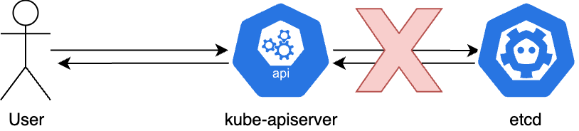

# 서론

Kubernetes 는 실제 사용자들의 Workload 를 실행시키는 [Data Plane](https://kubernetes.io/docs/reference/glossary/?all=true#term-data-plane) 와, 클러스터 전체를 관리하는 [**Control Plane**](https://kubernetes.io/docs/reference/glossary/?all=true#term-control-plane) 두가지의 추상화된 개념이 존재한다. `Control Plane` 은 대개 `kube-apiserver`, `etcd` (및 이 둘을 사용하는 기타등등) 으로 구성되어있고 `Control Plane` 에서 문제가 발생한다면 이 둘의 리소스 관리에 문제가 있을 가능성이 높다.

이 두가지에 대해서 간단히 소개해보면

- `kube-apiserver` 는 api 서버이다. HTTP(S) 로 `yaml`,` json`,` protobuf` 등의 형식으로 외부 클라이언트 (e.g., `kube-controller-manager`, `kubelet`, `kubectl` 등등등...) 들과 통신하며 RESTful 한 설계를 (거의) 잘 따라는 api 서버이다.
  클러스터상 리소스를 관리하기위한 [최소한의 기능](https://kubernetes.io/docs/reference/using-api/api-concepts/#api-verbs)이 잘 구현되어있으며 여기서 더 복잡해지는 로직 (Scheduling, Networking, Progressive Delivery 등등) 은 외부 컴포넌트 (`kube-scheduler` `kube-proxy` `cni` `argo` 등등) 에 맡기는 전형적인 MSA 구조를 따르고 있다.
- `etcd` 는 [KV DB](https://github.com/etcd-io/etcd/blob/v3.5.9/api/etcdserverpb/rpc.pb.go#L6425-L6448) 다. gRPC 로 `kube-apiserver` 와 통신하면서 RAFT 를 사용해 지내끼리 Leader 를 선출하고 Leader 가 모든 요청을 Write-Ahead Logging (WAL) 방식으로 기록하고 Follower 들에게 공유하는 방식으로 Split-brain 등의 [귀찮은 시나리오](https://github.blog/2018-10-30-oct21-post-incident-analysis/)를 처리하는 전형적인 CAP theorem 에서 흔히 말하는 CP/EC system 이다.

이 둘의 장점은 정말 안정적이다. 모종의 이유로 (주로 대부분은 ~~데이터센터 화재나~~ 운영자의 K8s 지식에 대한 부재) 죽을수는 있을지언정, 절대로 데이터가 꼬여서 수동복구를 해야하는 상황은 본적이 없다.

단점은, 안정성은 좋지만 성능이 별로다. 안정성을 위해서 성능을 희생시킨것도 존재하지만, 좀 더 단순하게 그냥 효율 자체가 안 좋은부분이 종종 보인다. 물론 이걸 해결하라고 하면 구조상 이슈가 있어서 고칠려면 전부 다 뜯어내고 고쳐야하지만, 어차피 프로덕션에서도 이정도 Scale 이슈가 발생하는 클러스터는 거의 없고 문제가 안되기때문에 아마 영원히(?) 안고쳐질꺼 같다.

이 글은 [최근 관련된 기능](https://kubernetes.io/docs/reference/using-api/api-concepts/#streaming-lists)이 하나 추가되었는데 예전에 삽질했던 기억을 떠올리며 한번 적어본다.

# Background - Response Time

`kubectl get pod -A` 명령어는 어떻게 작동할까?

일단 `kube-apiserver` 의 `/api/v1/pods` 로 GET 요청이 날라갈테고,
`kube-apiserver` 는 `etcd` 로 `/registry/pods` 를 prefix 로 가지는 모든 Key 들을 조회하는 `Range` 요청을 날리게 된다.

만약 클러스터 전체에 Pod 이 수백 ~ 수천개 수준이라면, 이 요청은 보통 수십 ms 안쪽으로 처리된다.

```bash
> curl -o /dev/null -s -w 'Total: %{time_total}s\n' 127.0.0.1:8001/api/v1/pods?limit=100
Total: 0.031002s # 31ms
```

근데 Pod 이 1만개가 있으면 어떨까?

```bash
> curl -o /dev/null -s -w 'Total: %{time_total}s\n' 127.0.0.1:8001/api/v1/pods?limit=10000
Total: 2.131027s # 2,131ms (100개대비 약 70배)
```

Pod Resource 한개당 처리속도를 x,
HTTPS 커넥션 수립 인증 인가 기타등등의 처리속도를 상수 c 라고 한다면

> 100x + c = 31ms
> 10000x + c = 2131ms
>
> x = 0.21ms
> c = 9.78ms
> ([출처](https://www.wolframalpha.com/input?i=100x+%2B+c+%3D+31%2C+10000x+%2B+c+%3D+2131), 공대출신은 계산기 없으면 계산 못합니다)

대충 리소스의 개수가 한개 늘어날때마다 `0.21ms` 정도의 처리속도 지연이 발생하게 된다.

# Background - Response Size

그럼 이때 다운받아지는 파일의 크기는 어떨까?

뭘 정의했고 어떻게 불러오냐에 따라서 달라지긴 하겠지만

```bash
> curl 127.0.0.1:8001/api/v1/pods?limit=100 > /dev/null
  % Total    % Received % Xferd  Average Speed   Time    Time     Time  Current
                                 Dload  Upload   Total   Spent    Left  Speed
100  455k    0  455k    0     0  14.8M      0 --:--:-- --:--:-- --:--:-- 14.8M
# 0.45MB
```

```bash
> curl 127.0.0.1:8001/api/v1/pods?limit=10000 > /dev/null
  % Total    % Received % Xferd  Average Speed   Time    Time     Time  Current
                                 Dload  Upload   Total   Spent    Left  Speed
100 44.4M    0 44.4M    0     0  21.2M      0 --:--:--  0:00:02 --:--:-- 21.2M
# 44.4MB
```

대충 1만개의 Pod 에 대한 리소스를 JSON 형식으로 다운 받는것은 `44.4MB` 정도 된다.

# Problem

사실 데이터 전송량 좀 커지고 응답속도 늦어지는건 큰 문제는 아니다. 어차피 K8s 세계에서 1~2초 정도 늦어지는건 대부분 큰 문제가 아니다. 그게 큰 문제라면 현재 시스템에 디자인 결함이 있는것이다. 전송 데이터 커지는것은 돈의 힘 (온프레임이라면 더 비싼 네트워크장비, 클라우드라면 더 많은 트래픽 비용) 으로 해결가능하다.

여기서 문제는 `kube-apiserver` 와 `etcd` 의 메모리 사용량이다.
`Kubernetes 1.27` `etcd 3.5` 버전이 최신인 현재를 기준으로 양쪽 모두

1. 응답을 돌려주기위해 메모리상에 필요한 모든 데이터를 적재한 뒤
2. 이를 사용자의 요청 포맷 (`protobuf` `json` `yaml` 등등) 에 맞게 변환한 것

을 돌려주고 있다.

그 결과 매 요청마다 다음과 같은 그래프를 확인할 수 있다.

### etcd 의 경우

etcd 는 요청이 올 때 (거의 대부분의 상황에서) 메모리에 적재되어있는 내용을 복사해서 응답으로 돌려준다.
요청 하나를 처리하는데 대략 30~60MB 정도의 메모리 공간이 필요하며 이는 10,000 개의 Pod Resource 를 Protobuf 로 저장했을때 필요한 저장공간 (35MB) 과 거의 유사하다.

```bash
# etcd 의 경우
# Resident Set Size (RSS) 값에 주목
> pidstat --human -r -p 7 1
Linux 5.15.0-75-generic (257102d738db)  06/25/23        _x86_64_        (256 CPU)

08:28:47      UID       PID  minflt/s  majflt/s     VSZ     RSS   %MEM  Command
# 프로세스 시작 후 안정화 상태
08:28:48        0         7      0.00      0.00   10.7G  110.0M   0.7%  etcd
# kube-apiserver 프로세스 시작
08:28:58        0         7      0.00      0.00   10.7G  110.0M   0.7%  etcd
08:28:59        0         7    130.00      0.00   10.7G  111.0M   0.7%  etcd
08:29:00        0         7   9376.00      0.00   10.8G  170.5M   1.1%  etcd
08:29:01        0         7     11.00      0.00   10.8G  170.5M   1.1%  etcd
08:29:02        0         7     14.00      0.00   10.8G  170.5M   1.1%  etcd
08:29:03        0         7    100.00      0.00   10.8G  171.2M   1.1%  etcd
08:29:04        0         7      0.00      0.00   10.8G  171.2M   1.1%  etcd
# 중간 생략
08:29:23        0         7      7.00      0.00   10.8G  171.5M   1.1%  etcd
# 첫번째 curl 127.0.0.1:8001/api/v1/pods?limit=10000 (메모리 사용량 60MB 증가)
08:29:24        0         7   6941.58      0.00   10.8G  236.7M   1.5%  etcd
08:29:25        0         7      0.00      0.00   10.8G  236.7M   1.5%  etcd
08:29:26        0         7      0.00      0.00   10.8G  236.7M   1.5%  etcd
08:29:27        0         7      0.00      0.00   10.8G  236.7M   1.5%  etcd
# 두번째 curl 127.0.0.1:8001/api/v1/pods?limit=10000 (메모리 사용량 30MB 증가)
08:29:28        0         7   1162.00      0.00   10.8G  265.0M   1.7%  etcd
08:29:29        0         7      0.00      0.00   10.8G  265.0M   1.7%  etcd
08:29:30        0         7      0.00      0.00   10.8G  265.0M   1.7%  etcd
08:29:31        0         7      0.00      0.00   10.8G  265.0M   1.7%  etcd
# 세번째 curl 127.0.0.1:8001/api/v1/pods?limit=10000 (메모리 사용량 유지)
08:29:32        0         7     28.00      0.00   10.8G  265.3M   1.7%  etcd
08:29:33        0         7      0.00      0.00   10.8G  265.3M   1.7%  etcd
08:29:34        0         7      0.00      0.00   10.8G  265.3M   1.7%  etcd
08:29:35        0         7      0.00      0.00   10.8G  265.3M   1.7%  etcd
# etcd GC 실행 (메모리 사용량 90MB 감소)
08:29:36        0         7   9306.00      0.00   10.9G  187.1M   1.2%  etcd
08:29:37        0         7      2.00      0.00   10.9G  187.1M   1.2%  etcd
```

### kube-apiserver 의 경우

`kube-apiserver` 의 경우 상황이 etcd 만큼 단순하지 않다.

요청을 받으면

1. etcd 로부터 protobuf 포맷으로 데이터를 받은 뒤
2. go struct 형태로 변환한것을 (deserialization, unmarshal)
3. 다시 json 형태로 변환 (serialization, marshal)

하는 과정이 최소한으로 들어가고 상황에 따라서 버전 변환 (e.g., `v1beta1` -> `v1`) 이나 List 형식에 맞게 타입변환을 하는 과정도 필요하다 (e.g., `Pod` -> `PodList`) 그 결과 `kube-apiserver` 는 매 요청당 100MB 내외의 메모리를 필요로 한다. 이는 앞서 다운받은 `44.4MB` 의 json 데이터의 대략 2.5배 정도 되는 크기이다.

```bash
# kube-apiserver 의 경우
# Resident Set Size (RSS) 값에 주목
> pidstat --human -r -p 7 1
Linux 5.15.0-75-generic (257102d738db)  06/25/23        _x86_64_        (256 CPU)

08:41:43      UID       PID  minflt/s  majflt/s     VSZ     RSS   %MEM  Command
# 프로세스 시작 후 안정화 상태
08:41:44        0         7      0.00      0.00    1.4G  691.4M   4.3%  kube-apiserver
08:41:45        0         7      1.00      0.00    1.4G  691.4M   4.3%  kube-apiserver
08:41:46        0         7      0.00      0.00    1.4G  691.4M   4.3%  kube-apiserver
08:41:47        0         7      0.00      0.00    1.4G  691.4M   4.3%  kube-apiserver
08:41:48        0         7      8.00      0.00    1.4G  691.4M   4.3%  kube-apiserver
# 첫번째 curl 127.0.0.1:8001/api/v1/pods?limit=10000 (메모리 사용량 120MB 증가)
08:41:49        0         7   9304.00      0.00    1.4G  750.7M   4.7%  kube-apiserver
08:41:50        0         7    346.00      0.00    1.5G  815.9M   5.1%  kube-apiserver
08:41:51        0         7      1.00      0.00    1.5G  815.9M   5.1%  kube-apiserver
08:41:52        0         7      1.00      0.00    1.5G  815.9M   5.1%  kube-apiserver
# 두번째 curl 127.0.0.1:8001/api/v1/pods?limit=10000 (메모리 사용량 170MB 증가)
08:41:53        0         7    717.00      0.00    1.5G  845.0M   5.3%  kube-apiserver
08:41:54        0         7   1645.00      0.00    1.6G  942.7M   5.9%  kube-apiserver
08:41:55        0         7    278.00      0.00    1.6G  944.0M   5.9%  kube-apiserver
08:41:56        0         7      1.00      0.00    1.6G  944.0M   5.9%  kube-apiserver
# 세번째 curl 127.0.0.1:8001/api/v1/pods?limit=10000 (메모리 사용량 70MB 증가)
08:41:57        0         7     75.00      0.00    1.6G  944.2M   5.9%  kube-apiserver
08:41:58        0         7   1493.00      0.00    1.7G 1010.8M   6.3%  kube-apiserver
08:41:59        0         7      2.00      0.00    1.7G 1010.8M   6.3%  kube-apiserver
08:42:00        0         7      7.00      0.00    1.7G 1010.8M   6.3%  kube-apiserver
08:42:01        0         7      1.00      0.00    1.7G 1010.8M   6.3%  kube-apiserver
# 네번째 curl 127.0.0.1:8001/api/v1/pods?limit=10000 (메모리 사용량 20MB 증가)
08:42:02        0         7    526.00      0.00    1.7G    1.0G   6.4%  kube-apiserver
08:42:03        0         7   2636.00      0.00    1.8G    1.1G   7.2%  kube-apiserver
08:42:04        0         7      7.00      0.00    1.8G    1.1G   7.2%  kube-apiserver
08:42:05        0         7      0.00      0.00    1.8G    1.1G   7.2%  kube-apiserver
# 다섯번째 curl 127.0.0.1:8001/api/v1/pods?limit=10000 (메모리 사용량 100MB? 증가)
08:42:06        0         7  16652.00      0.00    2.0G    1.2G   7.8%  kube-apiserver
08:42:07        0         7   1883.00      0.00    2.0G    1.2G   7.9%  kube-apiserver
08:42:08        0         7      2.00      0.00    2.0G    1.1G   7.3%  kube-apiserver
08:42:09        0         7      0.00      0.00    2.0G    1.1G   7.3%  kube-apiserver
# 여섯번째 curl 127.0.0.1:8001/api/v1/pods?limit=10000 (메모리 사용량 감소)
08:42:10        0         7    184.00      0.00    2.0G    1.0G   6.6%  kube-apiserver
08:42:11        0         7      4.00      0.00    2.0G    1.0G   6.6%  kube-apiserver
08:42:12        0         7      0.00      0.00    2.0G    1.0G   6.6%  kube-apiserver
08:42:13        0         7      0.00      0.00    2.0G    1.0G   6.6%  kube-apiserver
# 일곱번째 curl 127.0.0.1:8001/api/v1/pods?limit=10000 (메모리 사용량 유지)
08:42:14        0         7     32.00      0.00    2.0G    1.0G   6.6%  kube-apiserver
08:42:15        0         7    353.00      0.00    2.0G    1.0G   6.6%  kube-apiserver
08:42:16        0         7      4.00      0.00    2.0G    1.0G   6.6%  kube-apiserver
08:42:17        0         7      0.00      0.00    2.0G    1.0G   6.6%  kube-apiserver
08:42:18        0         7      1.00      0.00    2.0G    1.0G   6.6%  kube-apiserver
# 여덟번째 curl 127.0.0.1:8001/api/v1/pods?limit=10000 (메모리 사용량 유지)
08:42:19        0         7   1137.00      0.00    2.0G    1.1G   6.9%  kube-apiserver
08:42:20        0         7      0.00      0.00    2.0G    1.1G   6.9%  kube-apiserver
08:42:21        0         7      0.00      0.00    2.0G    1.1G   6.9%  kube-apiserver
08:42:22        0         7      0.00      0.00    2.0G    1.1G   6.9%  kube-apiserver
```

# 그래서 이게 왜 문제일까?

물론 요청당 수십MB 씩 메모리를 필요로 하는것은 꽤 크긴 하지만, 이는 단발성이다. 요청이 끝나면 메모리는 해제되며 다음 GC 때 이 메모리는 운영체제에게 반환된다. 하지만 이런 요청이 100개가 동시에 들어온다면 어떨까?

### kube-apiserver 의 경우

기껏해야 1GB 정도 사용할까 말까 했던 `kube-apiserver` 메모리 용량이 30초도 안되는 시간에 그 6배인 6GB 까지 가더니 cgroup 으로 설정한 hard limit 을 넘어가 OOM Killed 당했다.

```bash
# kube-apiserver 의 경우
# Resident Set Size (RSS) 값에 주목
> pidstat --human -r -p 7 1
Linux 5.15.0-75-generic (36ebf0245e96)  06/26/23        _x86_64_        (256 CPU)

01:52:22      UID       PID  minflt/s  majflt/s     VSZ     RSS   %MEM  Command
01:52:29        0         7      0.00      0.00    1.4G  693.6M   4.3%  kube-apiserver
01:52:30        0         7      1.00      0.00    1.4G  693.6M   4.3%  kube-apiserver
01:52:31        0         7      2.00      0.00    1.4G  693.6M   4.3%  kube-apiserver
01:52:32        0         7      5.00      0.00    1.4G  693.6M   4.3%  kube-apiserver
01:52:33        0         7      0.00      0.00    1.4G  693.6M   4.3%  kube-apiserver
# ab -c 100 -n 100 127.0.0.1:8001/api/v1/pods
01:52:34        0         7    118.00      0.00    1.4G  693.9M   4.3%  kube-apiserver
01:52:35        0         7   3114.00      0.00    1.5G  780.8M   4.9%  kube-apiserver
01:52:36        0         7   1686.00      0.00    1.5G  787.0M   4.9%  kube-apiserver
01:52:37        0         7     17.00      0.00    1.5G  787.3M   4.9%  kube-apiserver
01:52:38        0         7     23.00      0.00    1.5G  787.3M   4.9%  kube-apiserver
01:52:39        0         7     22.00      0.00    1.5G  787.3M   4.9%  kube-apiserver
01:52:40        0         7     35.00      0.00    1.5G  787.5M   4.9%  kube-apiserver
01:52:41        0         7   6526.00      0.00    1.6G  860.2M   5.4%  kube-apiserver
01:52:42        0         7  48340.00      1.00    2.1G    1.1G   7.0%  kube-apiserver
01:52:43        0         7  34056.00      0.00    2.7G    1.4G   8.7%  kube-apiserver
01:52:44        0         7  34789.00      0.00    3.9G    1.7G  10.9%  kube-apiserver
01:52:45        0         7  36829.00      0.00    4.8G    2.2G  14.2%  kube-apiserver
01:52:46        0         7  70896.00      0.00    5.2G    2.7G  17.5%  kube-apiserver
01:52:47        0         7  64348.00      1.00    5.5G    3.2G  20.4%  kube-apiserver
01:52:48        0         7  99643.00      0.00    6.1G    3.9G  24.8%  kube-apiserver
01:52:49        0         7   7634.00      1.00    6.1G    4.0G  25.8%  kube-apiserver
01:52:50        0         7   8189.11      0.00    6.4G    4.4G  28.0%  kube-apiserver
01:52:51        0         7  26415.00      0.00    6.7G    4.7G  30.3%  kube-apiserver
01:52:52        0         7  31627.45      0.00    6.8G    5.0G  32.2%  kube-apiserver
01:52:53        0         7  47195.00      0.00    7.1G    5.4G  34.5%  kube-apiserver
01:52:54        0         7  38151.00      0.00    7.4G    5.7G  36.5%  kube-apiserver
01:52:55        0         7  36775.00      0.00    7.6G    6.0G  38.2%  kube-apiserver
# OOM Killed
01:52:56        0         7   5954.00      0.00    0.0k    0.0k   0.0%  kube-apiserver
```

### etcd 의 경우

etcd 의 경우도 상황이 비슷해서 같은 시간동안 평소에 200MB 도 제대로 사용 안하던 메모리 사용량이 그 30배인 6GB 까지 치솟더니 요청을 걸어주는 클라이언트가 죽으니깐 그 상태를 유지하게 된다.

```bash
# etcd 의 경우
# Resident Set Size (RSS) 값에 주목
> pidstat --human -r -p 7 1
Linux 5.15.0-75-generic (36ebf0245e96)  06/26/23        _x86_64_        (256 CPU)

01:52:24      UID       PID  minflt/s  majflt/s     VSZ     RSS   %MEM  Command
01:52:30        0         7      0.00      0.00   10.8G  165.4M   1.0%  etcd
01:52:31        0         7      0.00      0.00   10.8G  165.4M   1.0%  etcd
01:52:32        0         7      2.00      0.00   10.8G  165.4M   1.0%  etcd
01:52:33        0         7      0.00      0.00   10.8G  165.4M   1.0%  etcd
# ab -c 100 -n 100 127.0.0.1:8001/api/v1/pods
01:52:34        0         7   1066.00      0.00   10.8G  164.3M   1.0%  etcd
01:52:35        0         7      0.00      0.00   10.8G  164.3M   1.0%  etcd
01:52:36        0         7 147810.00      0.00   11.4G  583.3M   3.6%  etcd
01:52:37        0         7 113682.00      0.00   11.7G    1.0G   6.4%  etcd
01:52:38        0         7 140902.00      0.00   12.3G    1.5G   9.8%  etcd
01:52:39        0         7 140856.00      0.00   12.7G    2.1G  13.3%  etcd
01:52:40        0         7 136235.00      0.00   13.3G    2.6G  16.6%  etcd
01:52:41        0         7  99380.20      0.00   13.7G    3.1G  19.8%  etcd
01:52:42        0         7  77303.00      0.00   14.5G    3.9G  24.9%  etcd
01:52:43        0         7  45276.00      0.00   15.1G    4.5G  28.7%  etcd
01:52:44        0         7  28677.00      0.00   16.1G    5.4G  34.6%  etcd
01:52:45        0         7  14475.00      0.00   16.6G    6.0G  38.1%  etcd
01:52:46        0         7     17.00      0.00   16.6G    6.0G  38.1%  etcd
01:52:47        0         7      1.00      0.00   16.6G    6.0G  38.1%  etcd
01:52:48        0         7      0.00      0.00   16.6G    6.0G  38.1%  etcd
01:52:49        0         7      5.00      0.00   16.6G    6.0G  38.1%  etcd
01:52:50        0         7      0.00      0.00   16.6G    6.0G  38.1%  etcd
01:52:51        0         7      1.00      0.00   16.6G    6.0G  38.1%  etcd
01:52:52        0         7      0.99      0.00   16.6G    6.0G  38.1%  etcd
01:52:53        0         7      5.00      0.00   16.6G    6.0G  38.1%  etcd
01:52:54        0         7      7.00      0.00   16.6G    6.0G  38.1%  etcd
01:52:55        0         7     21.00      0.00   16.6G    6.0G  38.1%  etcd
# kube-apiserver OOM Killed
01:52:56        0         7      0.00      0.00   16.6G    6.0G  38.1%  etcd
01:52:57        0         7      6.00      0.00   16.6G    6.0G  38.1%  etcd
01:52:58        0         7      0.00      0.00   16.6G    6.0G  38.1%  etcd
01:52:59        0         7      0.00      0.00   16.6G    6.0G  38.1%  etcd
01:53:00        0         7      0.00      0.00   16.6G    6.0G  38.1%  etcd
01:53:01        0         7      0.00      0.00   16.6G    6.0G  38.1%  etcd
# 한참 뒤 GC 수행 이후
01:59:58        0         7      0.00      0.00   16.6G  327.5M   2.0%  etcd
01:59:59        0         7      0.00      0.00   16.6G  327.5M   2.0%  etcd
```

# 왜 이런 문제가 발생하는 것일까?

이 모든것의 첫번째 원인은 etcd 의 Transaction 이다.

etcd 는 읽는 도중에 데이터가 변경되는 상황에 대해 안전한 동시성 처리를 위해서 Range 요청이 처리되는 동안 [Store 가 변경되지 않도록 Lock 을 걸어두고](https://github.com/etcd-io/etcd/blob/v3.5.9/server/mvcc/kvstore_txn.go#L42-L51), 이 Lock 이 걸리는 시간동안 [Range 요청에 해당하는 데이터를 복제](https://github.com/etcd-io/etcd/blob/v3.5.9/server/mvcc/index.go#L147-L163)하는데 이 과정에서 메모리 사용량이 늘어나게 된다. 이 과정을 만약 Zero Copy 로 구현할 경우 Lock 걸리는 시간을 protobuf 형태의 데이터를 완성될 때 까지로 늘어날 수 밖에 없는데, 이는 성능에 심각한 저하를 가져온다.

이러한 제약사항속에 열려있는 etcd API 는 [Range 밖에 없으니](https://github.com/etcd-io/etcd/blob/v3.5.9/api/etcdserverpb/rpc.proto#L14-L21) 여기서 두번째 문제가 발생한다. `kube-apiserver` 입장에서도 이를 마땅히 처리 할 방법이 없다. limits 가 크게 걸려있다면 그 요청을 그대로 보내는수밖에 없다.

하지만 리소스 1만개를 불러오는 요청은 2초가량의 시간이 소모되는 작업이고 2초 안쪽으로 100건의 같은 요청이 들어온다면 메모리는 급증할 수 밖에 없게되는 것이다.

# 언제 문제가 발생할까?

이 이슈가 발생하는 조건은 두가지이다.

1. 한번에 조회 가능한 리소스의 개수가 매우 많다.
2. 해당 리소스를 조회하는 요청이 매우 많다.

이러한 두 조건을 만족하는 대표적인 사례가 비활성화 된 `Pod` 이 많고, 노드 개수가 많은 상황이다. 본인이 발견한 대표적인 사례는 `Airflow` 와 `Kubeflow` 이다. ~~(하여간 flow 붙은놈들이 다 문제다.)~~

### 1. 한번에 조회 가능한 리소스의 개수가 매우 많다.

먼저 첫번째 조건에 대해서 이야기해보면 이 둘은 설정을 제대로 안해두면 단발성 작업 (e.g., CronJob) 으로 생성한 Pod 를 자동으로 삭제하지 않고 남겨둔다. 이러한 Pod 이 수십개 수준이면 별 문제가 안되지만 클러스터 관리자가 별 관심이 없다면 수천개 정도 쌓이는경우도 종종 발생한다. 이걸로 첫번째 조건을 충족한다.

### 2. 해당 리소스를 조회하는 요청이 매우 많다.

두번째 조건은 컨트롤러들의 동기화 전략과 인덱싱 부재와 관련된 문제이다.
쿠버네티스에는 수많은 컨트롤러들이 존재하지만, 그 중 노드 개수에 비례하게 늘어나는것들을 몇개 뽑아보면

1. kubelet
2. kube-proxy
3. CNI agents (cilium, calico, flannel 기타등등)

등이 존재한다.

이들은 평소에는 Watch API 를 통해서 상태가 변화되는 Pod 들에 대한 정보만 받는 형태로 정말 효율적으로 작동한다. 하지만 모종의 이유로 Controlplane 으로 가는 TCP 커넥션들이 순단된 상황을 생각해보자. (이런일은 Loadbalancer 에 의해서 생각보다 자주 발생한다.)

이때 각 노드에 존재하는 `kuelet` 과 같은 컨트롤러들은 최신 상태를 동기화 하기위해
`/api/v1/pods?fieldSelector=spec.nodeName=worker-node-10`
위와같이 fieldSelector 를 명시해서 `kube-apiserver` 에 요청을 보내게 되고 `kubelet` 은 자신이 원하는 데이터만 받게 되지만...

```json
// etcd 로그
{
  "level": "warn",
  "ts": "2023-06-26T01:52:44.693121Z",
  "caller": "etcdserver/util.go:170",
  "msg": "apply request took too long",
  "took": "1.875451825s",
  "expected-duration": "100ms",
  "prefix": "read-only range ",
  "request": "key:\"/registry/pods/\" range_end:\"/registry/pods0\" ",
  "response": "range_response_count:20037 size:28870318"
}
```

`etcd` 는 아니다. `kube-apiserver` 는 `spec.nodeName` 에 대한 인덱싱을 해두고 있지 않기 때문에, `etcd` 는 단순한 KV Storage 이기 때문에 `spec.nodeName=worker-node-10` 인 Pod 를 찾으려면 모든 리소스를 하나하나 검사해보는 방법밖에 없고 `kube-apiserver` 는 `etcd` 로부터 모든 정보를 불러오는 요청을 보내게 된다.

즉, `kube-apiserver` 는 살아남는다해도 `etcd` 는 죽어버리는 상황이 발생한다는 것이다.

# 해결법

### API 관점의 해결법

당연히 K8s 개발자들도 이러한 사실은 잘 알고있고, 해결법은 이미 어느정도 나온 상태이다.

#### Limit / Continue (API 서버에 대한 최소한의 예의)

첫번째 해결법은 `limit` `continue` 활용이다. 한번에 조회되는 양이 많아서 문제라면, 한번에 조회되는 양을 줄이면 된다. `kubectl`, `kubelet` 을 포함한 거의 모든 K8s 프로젝트는 이 둘을 활용해서 한번에 최대 500개씩 조회를한다.

다음은 실제 kubectl 이 API 요청을 보내는 예시이다.

```bash
> root@36ebf0245e96:~# kubectl get po -v6
I0626 04:14:00.931736      77 loader.go:373] Config loaded from file:  /etc/kubernetes/admin.conf
I0626 04:14:01.008707      77 round_trippers.go:553] GET https://127.0.0.1:6443/api/v1/namespaces/default/pods?limit=500 200 OK in 66 milliseconds
I0626 04:14:01.105069      77 round_trippers.go:553] GET https://127.0.0.1:6443/api/v1/namespaces/default/pods?continue=eyJ2IjoibWV0YS5rOHMuaW8vdjEiLCJydiI6MzkzNDcsInN0YXJ0IjoidGVzdC01NzQ2ZDRjNTlmLTJuNTUyXHUwMDAwIn0&limit=500 200 OK in 47 milliseconds
I0626 04:14:01.198811      77 round_trippers.go:553] GET https://127.0.0.1:6443/api/v1/namespaces/default/pods?continue=eyJ2IjoibWV0YS5rOHMuaW8vdjEiLCJydiI6MzkzNDcsInN0YXJ0IjoidGVzdC01NzQ2ZDRjNTlmLTRiOHpzXHUwMDAwIn0&limit=500 200 OK in 44 milliseconds
I0626 04:14:01.297993      77 round_trippers.go:553] GET https://127.0.0.1:6443/api/v1/namespaces/default/pods?continue=eyJ2IjoibWV0YS5rOHMuaW8vdjEiLCJydiI6MzkzNDcsInN0YXJ0IjoidGVzdC01NzQ2ZDRjNTlmLTR6czh3XHUwMDAwIn0&limit=500
(이하생략)
```

#### ResourceVersion / ResourceVersionMatch (etcd 만큼은 살리겠다는 의지)

두번째 해결법은 `ResourceVersion` 과 `ResourceVersionMatch` 를 적당이 활용하는 것이다. ([참고](https://kubernetes.io/docs/reference/using-api/api-concepts/#resource-versions)) 이 둘은 Strong Consistency 가 필요하지 않은경우 유효한 해결법으로 **resourceVersion="0"** 으로 요청을 날릴경우 `etcd` 에서 최신 데이터를 가지고오지 않고 `kube-apiserver` [캐시에 저장된](https://danielmangum.com/posts/k8s-asa-watching-and-caching/) 데이터를 그냥 가져온다.



최신 정보가 수집된다는 보장은 없지만, 어차피 다른 컨트롤러가 Watch 하면서 (`kube-controller-manager` 는 언제나 모든 Pod 을 바라보고 있다) 어쩔수 없이 받게된 정보가 kube-apiserver 캐시에 저장됨으로 나름 최신의 정보를 지속적으로 받게된다.

```bash
# kube-apiserver
# ab -c 100 -n 200 127.0.0.1:8001/api/v1/pods?resourceVersion=0
04:35:01        0         7      6.00      0.00    1.4G  696.5M   4.4%  kube-apiserver
04:35:02        0         7      0.00      0.00    1.4G  696.5M   4.4%  kube-apiserver
04:35:03        0         7      1.00      0.00    1.4G  696.5M   4.4%  kube-apiserver
04:35:04        0         7    667.00      0.00    1.4G  706.9M   4.4%  kube-apiserver
04:35:05        0         7  14133.98      0.00    1.9G  767.0M   4.8%  kube-apiserver
04:35:06        0         7  53444.00      1.00    2.6G    1.3G   8.1%  kube-apiserver
04:35:07        0         7  25610.00      0.00    3.0G    1.5G   9.9%  kube-apiserver
04:35:08        0         7  53421.00      0.00    4.0G    2.3G  14.5%  kube-apiserver
04:35:09        0         7  41038.00      0.00    4.4G    2.5G  15.9%  kube-apiserver
04:35:10        0         7  55646.00      0.00    4.5G    2.7G  17.2%  kube-apiserver
04:35:11        0         7  57569.00      0.00    4.7G    3.1G  19.6%  kube-apiserver
04:35:12        0         7  71497.00      0.00    5.1G    3.5G  22.6%  kube-apiserver
04:35:13        0         7  32127.45      0.00    5.1G    3.7G  23.8%  kube-apiserver
04:35:14        0         7  26431.00      0.00    5.3G    3.9G  24.9%  kube-apiserver
04:35:15        0         7  65825.00      0.00    5.5G    4.3G  27.5%  kube-apiserver
04:35:16        0         7  64327.00      0.00    6.0G    4.7G  30.1%  kube-apiserver
04:35:17        0         7  56355.34      0.00    6.5G    5.3G  33.7%  kube-apiserver
04:35:18        0         7  40895.05      0.00    6.9G    5.7G  36.3%  kube-apiserver
# OOM KILLED
04:35:19        0         7  51130.00      0.00    0.0k    0.0k   0.0%  kube-apiserver
```

```bash
# etcd
# ab -c 100 -n 200 127.0.0.1:8001/api/v1/pods?resourceVersion=0
04:35:01        0         7      0.00      0.00   10.8G  164.2M   1.0%  etcd
04:35:02        0         7      3.00      0.00   10.8G  164.2M   1.0%  etcd
04:35:03        0         7      5.00      0.00   10.8G  164.2M   1.0%  etcd
04:35:04        0         7      1.00      0.00   10.8G  164.2M   1.0%  etcd
04:35:05        0         7      0.00      0.00   10.8G  164.2M   1.0%  etcd
04:35:06        0         7      4.00      0.00   10.8G  164.2M   1.0%  etcd
04:35:07        0         7      0.00      0.00   10.8G  164.2M   1.0%  etcd
04:35:08        0         7      0.00      0.00   10.8G  164.2M   1.0%  etcd
04:35:09        0         7      0.00      0.00   10.8G  164.2M   1.0%  etcd
04:35:10        0         7      2.00      0.00   10.8G  164.4M   1.0%  etcd
04:35:11        0         7      0.00      0.00   10.8G  164.4M   1.0%  etcd
04:35:13        0         7      0.00      0.00   10.8G  164.4M   1.0%  etcd
04:35:14        0         7      3.00      0.00   10.8G  164.4M   1.0%  etcd
04:35:15        0         7      1.98      0.00   10.8G  164.4M   1.0%  etcd
04:35:16        0         7      4.00      0.00   10.8G  164.4M   1.0%  etcd
04:35:17        0         7      4.00      0.00   10.8G  164.4M   1.0%  etcd
04:35:18        0         7      8.82      0.00   10.8G  164.4M   1.0%  etcd
# kube-apiserver OOM KILLED / etcd survived
04:35:19        0         7      0.00      0.00   10.8G  164.4M   1.0%  etcd
04:35:20        0         7    126.00      0.00   10.8G  164.9M   1.0%  etcd
```

물론 `kube-apiserver` 가 OOM 으로 죽게되는것은 피할 수 없지만, 어차피 `kube-apiserver` 는 `stateless` 하고 죽어도 수초안에 다시 회복됨으로 `etcd` 가 죽어서 쿼럼이 깨지는것보다는 훨씬 덜 치명적이다. (쿼럼은 한번 깨지면 모든 etcd 를 동시에 다 살려야지만 복구된다.)

이러한 내용들은 [Informer](https://pkg.go.dev/k8s.io/client-go/informers) 에 이미 반영된 내용들이며 `Infromer` pkg 를 사용하는 대부분의 Kubernetes 프로젝트들은 이러한 내용들이 이미 반영되어있다.

#### API Priority and Fairness (APF) (kube-apiserver 도 같이 살리겠다는 의지)

https://kubernetes.io/docs/concepts/cluster-administration/flow-control

사실 이 해결법은 앞서 말한 List 상황에 해당되는 문제는 아니다. APF 기본적인 컨셉은 Rate Limit 이다. 본래 `kube-apiserver` 에는 `max-requests-inflight` 가 걸려있어서 최대 동시처리 요청개수를 제한할 수 있지만... [기본값이 400](https://kubernetes.io/docs/reference/command-line-tools-reference/kube-apiserver/)이다. 동시 요청 100개만 넣어도 잘하면 메모리 사용량이 20GB 도 넘어가게 할 수 있는데 400은 큰 의미가 없을뿐더러 중요한거 안중요한거 다 합쳐서 제약을 거는바람에 별로 유용하지 못하다.

APF 는 이러한 API 요청에 대한 Rate Limit 을 좀 더 유연하게 가져가 보자는 맥락이다.

이에대한 자세한 사례는 독일산 DevOps 회사인 [palark](https://blog.palark.com/kubernetes-api-flow-control-management/)에서 잘 소개를 해줬는데, 대략적인 사용법은 다음 yaml 을 보면 이해하기가 쉽다.

```yaml
# Original Source: https://blog.palark.com/kubernetes-api-flow-control-management/
---
apiVersion: flowcontrol.apiserver.k8s.io/v1beta3
kind: FlowSchema # Flowcontrol 을 적용할 API 요청에 대한 조건
metadata:
  name: cilium-pods
spec:
  distinguisherMethod:
    type: ByUser
  matchingPrecedence: 1000 # 하나의 요청이 두개이상의 FlowSchema 에 걸릴때 우선권
  priorityLevelConfiguration:
    name: cilium-pods # 적용할 RateLimit 룰
  rules:
    - resourceRules:
        - apiGroups:
            - "cilium.io"
          clusterScope: true
          namespaces:
            - "*"
          resources:
            - "*"
          verbs:
            - "list"
      subjects:
        - group:
            name: system:serviceaccounts:d8-cni-cilium
          kind: Group
---
apiVersion: flowcontrol.apiserver.k8s.io/v1beta3
kind: PriorityLevelConfiguration
metadata:
  name: cilium-pods
spec:
  type: Limited # Exempt, Limited 중 택 1
  limited:
    nominalConcurrencyShares: 5
    # 본래는 assuredConcurrencyShares 였지만, 분산환경에서 코드짜기 복잡해져서 다음과 같이 적용
    # NominalCL(i)  = ceil( ServerCL * NCS(i) / sum_ncs )
    # sum_ncs = sum[limited priority level k] NCS(k)
    # CL = Concurrency Limit, NCS = nominalConcurrencyShares
    limitResponse:
      # 짧게 설명할 자신이 없어서 링크로 대체
      # https://github.com/kubernetes/enhancements/tree/master/keps/sig-api-machinery/1040-priority-and-fairness
      queuing:
        handSize: 4
        queueLengthLimit: 50
        queues: 16
      type: Queue # 지금 당장 처리못하는 요청은 Queue 넣었다가 지연된 응답보냄. Reject 도 선택
```

문제가 되는 프로젝트의 요청만 격리해서 처리가 가능해서 꽤 유연성이 좋다.

### 운영관점의 해결법

이 모든 문제는 애초에 리소스 개수가 많지 않으면 별 문제가 안된다.
불필요한 리소스를 지속적으로 삭제해주자.

# 결론

- 이 글에대한 아이디어는 [강의자료](https://learningspoons.com/course/detail/kubernetes/)로 써먹으려고 했다가 (시간관계상...) 못 쓴 내용입니다.

- 까먹고 있다가 최근 `kube-apiserver` 를 https://dailychat.io/ 이 사이트의 백엔드로 쓰는 해괴한짓을 한번 해봤는데 계속 엉뚱한 `kube-controller-manager` 가 죽길레 원인 탐색하다가 떠올랐습니다. (원인은 이 글과는 무관합니다)

- 오랜만에 블로그 글 쓰니깐 어렵네요...
