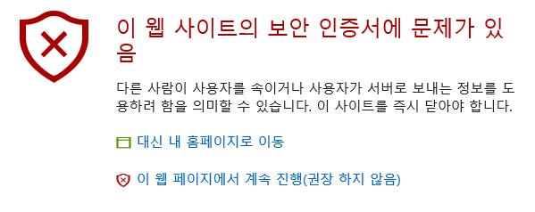

## 서론
필자가 다니는 학교 wifi는 교내라면 어디서든 심지어 야외에서도 빵빵하게 터지는 엄청난 장점과 함께 크나큰 단점이 한가지 있는데.....

라우터에서 http 통신내역을 까봐서 이것이 윈도우이면 보안을 위해 특정 프로그램을 설치하라는 홈페이지로 **강제** 리다이렉트 시킨다는 점이다.

물론 "그냥 깔면 되는거 아니에요?" 하겠지만..... 이놈이 윈도 XP용으로 맞춰 만들어져 있어서 윈도 7, 8.1, 10에서는 깔기만해도 블루스크린으로 만들어주는 아주 대단한 놈이다.

이에대한 대응으로 VPN을 쓴다던가 우분투를 쓴다던가 크롬을 개조해서 http요청헤더에서 윈도부분만 쏙 빼는 별 여러가지 방법을 써봤지만 뭔가 느려지기도 하고 일일히 설정하는게 귀찮아지기도 하고 윈도가 편하고....~~(리눅스는 터미널로만 조작하는 스타일이다.)~~  등의 이유로 별로 잘 사용하지 않게되었다.

그러다가 https는 요청헤더가 라우터에 까발려지지도 않아서 https로 제작된 사이트는~~(나X위키라던가 구X라던가 B잉 같은)~~ 자유롭게 접속 가능하다는 점을 알게 됬는데 학교에서 본인 http서버를 자유롭게 접속하기위해 본인의 서버를 https로 구성해본 경험을 적어보려 한다. ~~(사실 git서버 http통신으로 push하는데 이거때문에 해봤다는건 안비밀)~~

https에 대한 설명은 
https://namu.wiki/w/TLS
https://opentutorials.org/course/228/4894 
요 두개를 읽어보면 대충 이해할수 있다 생각된다.

## 1. 인증서 만들기
일단 https를 구현하기위한 개인키(.key), 서면요청파일(.csr) 그리고 인증서파일(.crt)가 필요하다.

보통 이 3가지는 CA에서 발급해주는 것을 쓰는게 정석이지만 필자의 경우 암호화 과정이 필요한거지 유사 사이트로 속여지는것에 대한 대비를 하자는게 아니기에 OpenSSL을 통해 자체적으로 만들것이다.

OpenSSL은 apt던 yum 이던 기본적으로 제공해주는 프로그램이니 각자 알아서 설치해주시고

적당한 폴더에 들어가서

`openssl req -new -newkey rsa:2048 -nodes -keyout 도메인이름.key -out 도메인이름.csr`

를 입력하고 (도메인이름이라곤 했지만 사실 뭘 쓰던 큰 상관은 없다.)

    Generating a 2048 bit RSA private key
    .............................+++
    ......................................................+++
    writing new private key to '도메인이름.key'
    -----
    You are about to be asked to enter information that will be incorporated
    into your certificate request.
    What you are about to enter is what is called a Distinguished Name or a DN.
    There are quite a few fields but you can leave some blank
    For some fields there will be a default value,
    If you enter '.', the field will be left blank.
    -----
    Country Name (2 letter code) [AU]:
    State or Province Name (full name) [Some-State]:
    Locality Name (eg, city) []:
    Organization Name (eg, company) [Internet Widgits Pty Ltd]:
    Organizational Unit Name (eg, section) []:
    Common Name (e.g. server FQDN or YOUR name) []:
    Email Address []:
    
    Please enter the following 'extra' attributes
    to be sent with your certificate request
    A challenge password []:
    An optional company name []:

질문에 맞게 답해주면 .key파일고 .csr파일이 생성된다.  (참고로 개인용으로 쓸꺼면 진지하게 할 필요는 없다.)

그리고 나서

`openssl x509 -req -days 365 -in 도메인이름.csr -signkey 도메인이름.key -out 도메인이름.crt`

명령어를 입력해주면 .crt 파일이 생성되는데 이를 통해 nginx에서 필요로 하는 파일은 .crt파일과 .key파일이 완성되었다.

>참고로 
>crt파일은 `openssl x509 -in *.crt -noout -text` 
>csr파일은 `openssl req -in *.csr -noout -text` 
>명령어를 통해 그 내용을 볼 수 있다.

## 2. nginx에서 써먹기
수정해야할 파일은 `/etc/nginx/sites-enabled` 폴더속에 있는 아무 파일이다. 보통 default파일이 기본적으로 있으니 이걸 수정한다 가정하고 필요한 것은

        listen 443;
    
        ssl on;
        ssl_certificate /etc/SomeWhere/iwanhae.ga.crt; //crt경로
        ssl_certificate_key     /etc/SomeWhere/iwanhae.ga.key; //key경로
    
        //key는 유출되면 암호화가 무의미해지므로 보안을 철저히 해야한다.
이 4줄을 추가해 주는 것이다.

완성형으로 표현하면 대충 이런꼴이다.

    server {
    
        listen 443;
    
        ssl on;
        ssl_certificate /etc/SomeWhere/iwanhae.ga.crt;
        ssl_certificate_key     /etc/SomeWhere/iwanhae.ga.key;
    
        server_name blog.iwanhae.ga;
    
        //...//
    }
이렇게 해주면 하나의 server { ... } 에 대해서 443 포트에서 ssl이 적용된다.
다만 이럴경우 80번 포트는 열린적이 없어지게 되므로 기존 주소로 접근시에는 접속 거부가 뜨게된다.

    server{
            server_name blog.iwanhae.ga;
            rewrite ^ https://$server_name$request_uri? permanent;
    }

이런식으로 새로운 server { ... } 를 만들어 자동으로 redirect 시키는걸 추천하지만.....

CA에서 발급되지 않은 인증서를 쓰므로 다음과 같은 경고장이 날아오게 된다.

개인적 용도라면 별 상관없지만 공적인 용도라면 이 블로그처럼 http, https 모두 지원하게 설정해 놓는걸 추천한다.

http://blog.iwanhae.ga
https://blog.iwanhae.ga

## 덤
`git clone`하면 보안문제때문에 clone이 안된다. 
`git -c http.sslVerify=false clone`을 통해 강제로 할수 있으니 참고하자.

## 마무리
https는 비록 심심풀이로 한 일이지만 꽤 괜찮다. 뭔가 암호화 됬다는 느낌과 함께 각종 라우터의 탐색은 모두 무시되고 ~~(kt의 컴퓨터 대수제한이라던가 warning.or.kr이라던가...)~~ 별로 기대하지 않았는데 OwnCloud에서 보안설정하라는 메세지도 안뜬다!!!

는 농담이고 일반적으로 이윤을 추구하지 않는 사이트 운영자는 아마 https를 별로 쓸일은 없을것이다. (있다면 부디 댓글로 남겨주길 바란다. 순수한 호기심이다.)

하지만 적어도 본인은 학교에서 자유롭게 본인 사이트에 접속할 수 있게되었고 웹페이지 기반 ssh, git서버, IDE, phpmyadmin~~, 영화사이트~~를 학교 와이파이로 만지작만지작 거릴수 있게되어 솔직하게 기쁘다.

궁금한점 있으면 댓글로 남겨주면 가능한 범위내에서 답변은 해주겠지만 본인도 새로운 분야이기에 가능하면 자문자답을 댓글로 해줬으면 하는 바람이다.

## 2020년에 적는 코멘트

Google이 밀어준다고 https가 이렇게 활성화 될 줄 누가 알았겠어요? ㄷㄷ;;;

그당시에도 Let's encrypt가 존재는 했었지만 그떄는 별로 인기가 없었고 https는 개인서버 운영자에게는 단순히 귀찮을 존재였을 뿐입니다.

지금은 안쓰면 검색노출도 안되는 기본적인 존재이지만요. 본 서버는 아마 바뀔지도 모르지만 기본적으로 Kubernetes + ingress nginx 환경에서 http**s**로 제공됩니다.

