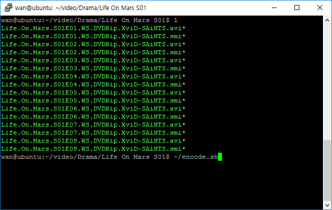
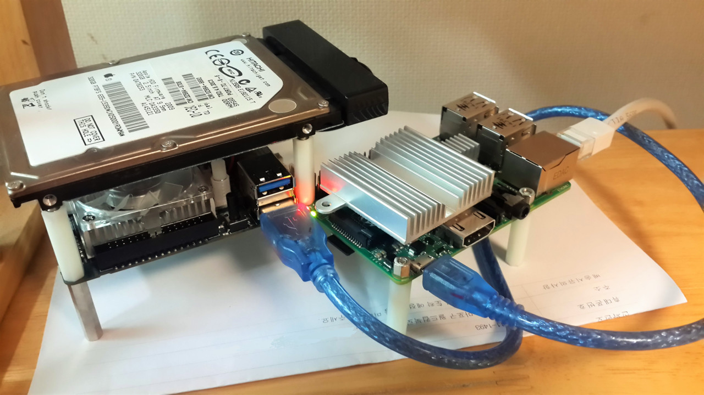

## 서론

현재 본인은 이 블로그서버를 운영하며 친구들, 지인끼리 동영상공유로도 사용하고 있다. 문제가 있다면 코덱이 워낙 다양한탓에 HTML5로 재생이 안되던가 스마트폰으로 스트리밍으로 재생하기에는 너무 무거운 동영상들이 있다는 것이다. 보통은 해당영상을 다른버전으로 다운받아 해결하지만 그게 힘들경우 따로 인코딩을 하는데 지금부터 라즈베리파이에서 인코딩을 하는법을 소개하겠다.

하는것은 자유지만 미리 말해두자면 라즈베리 파이의 성능이 성능인만큼 꽤 느리다. 보통 0.12배속으로 인코딩이 진행되는데 24분짜리 영상 인코딩하는데 3~4시간정도 걸린다. (참고로 오드로이드 XU4의 경우 1.1배속정도 나온다.)~~(단점은 쿨러소리가 상당하다는점)~~

## 준비물
보통 대부분은 있지만 일부 배포판의경우 배포 용량을 줄이기위해 자주 빠지는 패키지들을 설치해주자. 설치가 되있다면 그냥 넘어가니 그냥 다음 명령어를 입력하자.

```bash
apt-get install git build-essential
```

## FFMPEG설치하기
```bash
cd /usr/src
git clone git://git.videolan.org/x264
cd x264
./configure --host=arm-unknown-linux-gnueabi --enable-static
make -j4
sudo make install

cd /usr/src
git clone git://source.ffmpeg.org/ffmpeg.git
cd ffmpeg
sudo ./configure --arch=armel --target-os=linux --enable-gpl --enable-libx264 --enable-nonfree
make -j4
sudo make install
```

다음을 스크립트**(.sh파일)**로 만들어서 루트권한으로 실행시켜주자. 전반부는 가장 많은 기기가 지원하는 H264코덱관련 라이브러리를 설치하는부분이고 후반은 ffmpeg를 설치하는 부분이다.

[여기](./install-ffmpeg.sh)서 완성된 파일을 다운받을수도 있다.

시간이 꽤 걸린다. 켜놓고 딴짓하기 좋은 상황에서 실행하기를 권장한다.

>오드로이드 XU4의경우 OpenCL(GPU가속)이 지원된다. 아직 인코딩에서 되는건 아니지만 후반부 `./configure`할때 `--enable-opencl`옵션을 추가해주자. 

## 인코딩하기
인코딩방법은 간단하다.<br>
`ffmpeg -i [입력파일] -vcodec libx264 [출력파일]`<br>
아니면 <br>
`ffmpeg -i [입력파일] -s 1280x720 -vcodec libx264 [출력파일]`<br>
과 같이해서 화면크기를 다르게 하던가<br>
`ffmpeg -i [입력파일] -s 1280x720 -threads 1 -vcodec libx264 [출력파일]`<br>
과 같이해서 단일스레드로 인코딩을 진행시킬수도 있다.

옵션은 여러가지가 있으며 각자 자신이 원하는 설정에 맞춰 진행하도록 하자.
일반적으로 이정도 설정이면 핸드폰이나 웹브라우저에서 감상하는데 지장은 없다. (오디오쪽은 불확실)

## 덤
심슨이나 영드같은 하나의 세트로 구성되있는 영상의경우 이 명령어는 한번에 하나씩밖에 못하며 그나마도 한번 입력하면 최소 4시간뒤에 다시 입력해줘야한다..... ~~(수면중 인코딩은 꿈건너 얘기)~~

그런분들을 위해 간단한 스크립트를 소개한다. 

```bash
mkdir bak
mkdir tmp
for i in *.avi; do
 echo "$i"
 ffmpeg -i "$i" -vcodec libx264 "./tmp/$i"
 mv "$i" "./bak/$i"
 mv "./tmp/$i" "$i"
done
```
이 스크립트를 소개하자면 이 sh파일을 실행시킨 경로에서 모든 avi파일을 찾아낸뒤 tmp폴더에 인코딩 결과물을 생성하고 인코딩이 완료됬을때 기존파일은 bak폴더로, 인코딩된 파일을 원래위치로 옮겨주는 스크립트이다. 각자 상황에 맞게 수정해서 사용하자.
>사용예시
>
>
>
>`encode.sh`위 스크립트내용이 그대로 들어가있는 파일이다. 영상이 있는 장소에서 다음과 같이 명령어를 사용하면된다.

## 덤2
참고로 본인은 이렇게 사용하고 있다.


사람없을때는 ODROID XU4가 엄청나게 시끄러운 소음을 내며 인코딩 사람 있을때는 RASPBERRYPI2에 전원을 공급하고 NFS로 ODROID XU4의 영상파일에 접근해 영상 인코딩.