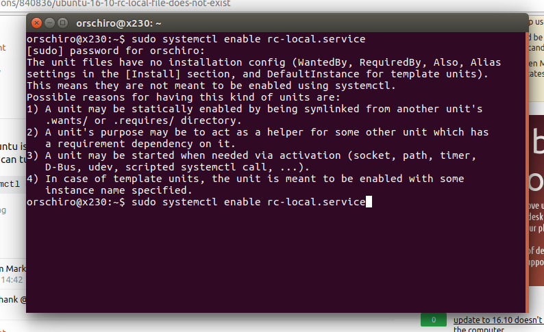

## 서론
좀 전부터 systemd가 흥하다 싶더니 순식간에 레드헷계열은 물론이요 데비안도 전부 systemd를 사용하게 되었습니다.

[Systmed란?(ZDnet기사)](http://www.zdnet.com/article/linus-torvalds-and-others-on-linuxs-systemd/)

사실 전 이런거에 별로 익숙치 않아서 여태껏 별로 신경쓰지 않고 기존 시스템을 사용해 왔는데....... 얼마전 서버를 아폴로 레이크로 바꾸니깐 커널이 4.8부터 지원하고(...) 그거 되는 서버가 우분투 16.10밖에 없고(...) 우분투 16.10은 완벽하게 systemd사용하고 있고(...)

근데 그 무엇보다..... RC.LOCAL이 비활성화가 기본이더군요.....

뭐 솔직히 systemd가 좋긴 좋아요. 로깅도 자동으로 되고, 꺼져도 알아서 다시 켜지게 할 수도 있고, 예약도 훨씬더 편하게 설정해 놓을수 있고, 의존성 문제 해결도 쉬워요.

하지만 이건 상용이 아닌 개인용 서버. 서비스 등록해 놓는게 귀찮은 프로세서가 더 많다는게 함정. 그리고 이럴땐 rc.local이 최고!

란 느낌으로 고생고생해서 rc.local 활성화 시켜놓은 기록 남겨둡니다.

## 본론
일단 결론부터 말하면 rc.local이 적용되있지는 않지만 사라진건 아닙니다. 비활성화된 상태일 뿐이죠.

그럼 활성화 시켜봅시다.......

`sudo systemctl enable rc-local.service`

근데.... 음....?

하하하! 안되네욤(쩝...) ~~(사진은 적당히 퍼온거)~~

우분투 16.10에서 위 명령어 실행시키면 서비스 등록시키는 파일 `rc-local.service`이 16.04기준으로 작성되었기 때문에(?) 제대로 작동 안됩니다.

그럼 이 파일을 제대로 작동되게 해봅시다. rc-local.service은 다음 위치에 존재합니다.

    /lib/systemd/sytem/rc-local.service

이 파일내용을 보면

    #  This file is part of systemd.
    #
    #  systemd is free software; you can redistribute it and/or modify it
    #  under the terms of the GNU Lesser General Public License as published by
    #  the Free Software Foundation; either version 2.1 of the License, or
    #  (at your option) any later version.
    
    # This unit gets pulled automatically into multi-user.target by
    # systemd-rc-local-generator if /etc/rc.local is executable.
    [Unit]
    Description=/etc/rc.local Compatibility
    ConditionFileIsExecutable=/etc/rc.local
    After=network.target
    
    [Service]
    Type=forking
    ExecStart=/etc/rc.local start
    TimeoutSec=0
    RemainAfterExit=yes
    GuessMainPID=no

이런 느낌으로 되어있는데 위 오류메세지를 보면 알수 있다싶이 `[Install]`부분이 없어서 제대로 작동 못시키겠다고 하니, 추가시켜 줍시다.

    [Install]
    WantedBy=multi-user.target

(자세한 의미는 [여기](https://www.digitalocean.com/community/tutorials/understanding-systemd-units-and-unit-files)참조)

그 후 `sudo systemctl enable rc-local.service` 해주면 제대로 rc.local서비스가 활성화 됩니다.

이제 하던데로 `/etc/rc.local`파일 작성해서 사용해 주면 됩니다. (실행권한주는거 잊지 마세요~)

