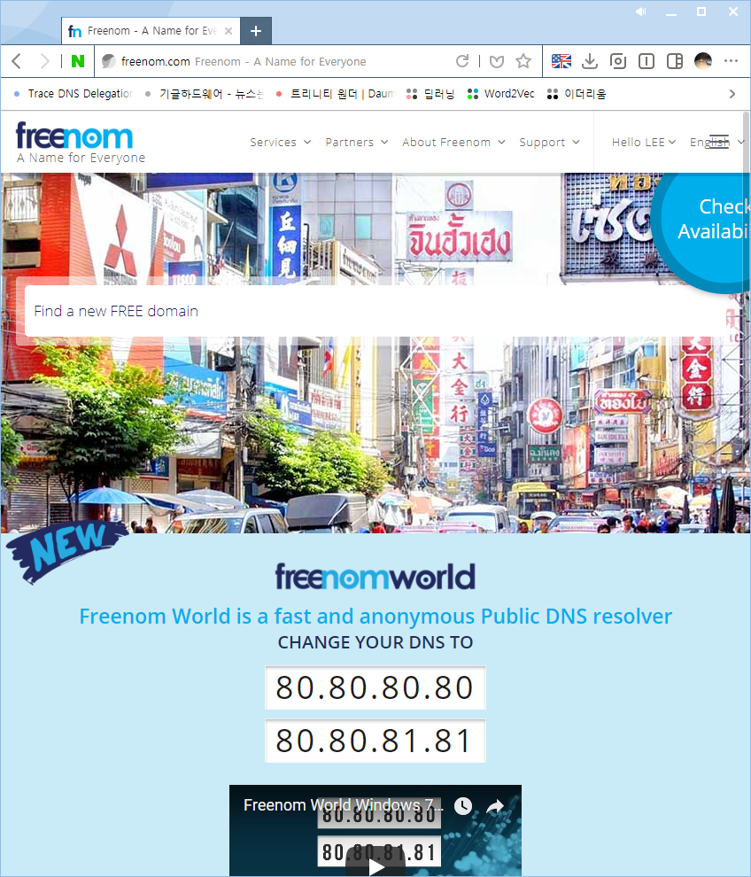
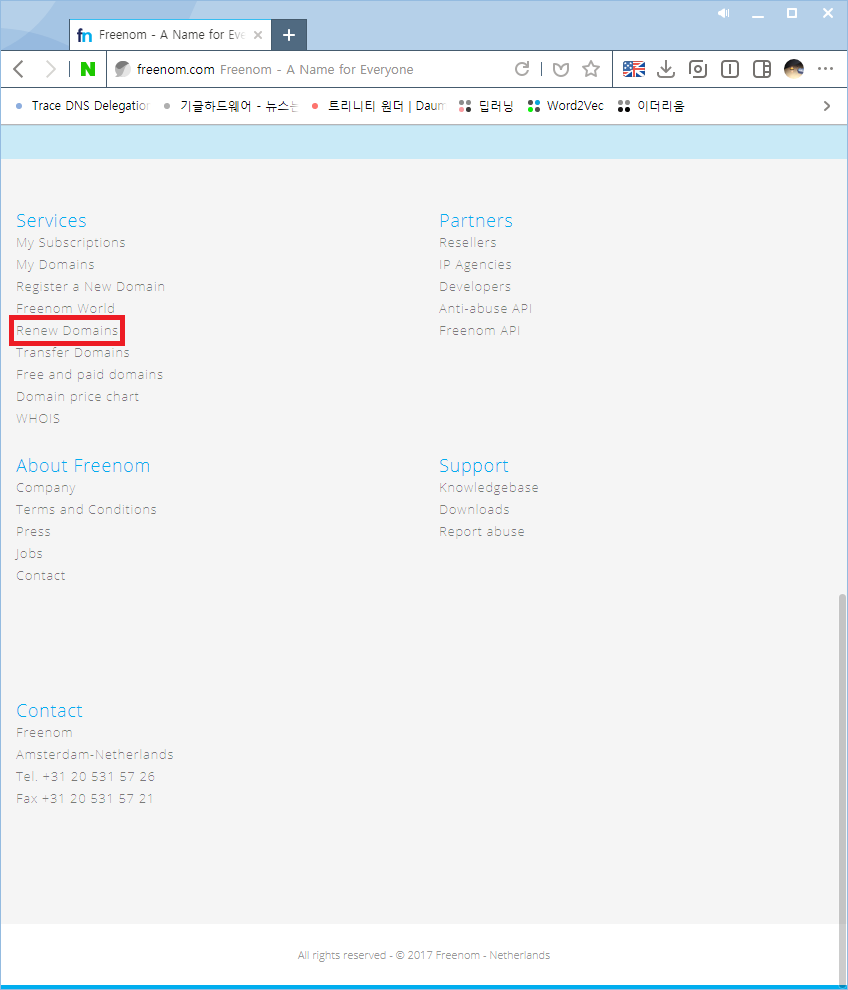
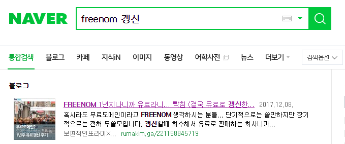

## 서론
매년 12월마다 iwanhae.ga 도메인을 갱신하는일을 벌써 3번째 해보는데
할때마다 까먹고 Ticket만들어서 어떻게 하냐고 물어보는거 짜증나서 적어둔다.

## 본론
알아두어야 할 점은

1. Expire되기 14일 전 부터 갱신가능
2. 최대 12개월 연장가능
3. 연장횟수는 무제한
4. Expire 되기전에 Renew하지 못하면 몇달동안 해당 도메인은 유료가 되버려서 결국 카드결제 해야됨

정도고 방법은

http://www.freenom.com
에 들어가면

요런 메인페이지가 나오는데

요기에 Renew 버튼이 있다.

그리고 Renew하면 된다.

끗

## 후기

~~사실 이분 너무 안쓰러워서 작성함......~~