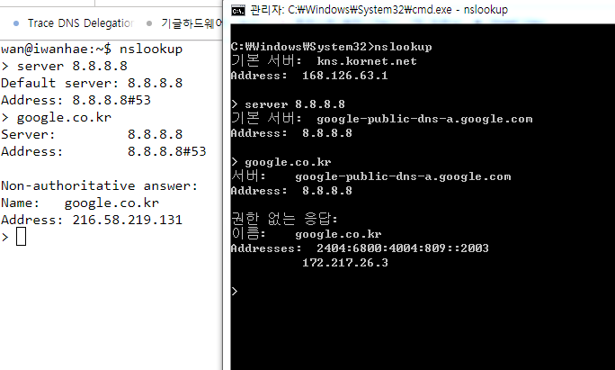

## 서론
군인이다....

비록 군대에 있긴하지만 일과시간만 벗어나면 어느정도 자유시간이 보장되며 필자도 정기적으로 사지방에 와서 인터넷 세계를 맛볼수 있다.

다만 문제가 되는게.......

1. 80번 443번 포트를 제외하고 모두 막혀있음
2. 구글 접속이 안됨

1번은 일반적으로 크게 문제되는일은 없겠지만 필자의경우 ssh 접속에 제한되어 큰 골칫거리였다. 이에대한 해결법은 [여기](https://blog.iwanhae.ga/shellinabox/)를 참고하기 바란다.

2번은 비교적 최근 완전한 해결법을 발견해 그에대해 설명해보고자 한다.

## 본론
사지방에서 구글이 안되는이유는 크게 두가지정도로 추정된다.

#### 이유 1, DNS의 오류
 하나는 DNS정보를 잘못받아온다. 사지방은 인터넷 사업자별로 각 ISP가 제공하는 기본 DNS서버를 사용해서 각 도메인에 대한 IP주소를 받아오는데 이게 일반적으로 알려진 구글의 IP주소가 아닌 이상한 IP주소를 받아온다.

 아마 ISP측에서 군의 요청을 받고 구글 본 서버가 아닌 Proxy 서버로 안내하는 거라 추정되는데 문제는 이 Proxy서버가 제대로 작동하는놈이 아니라서 ~~(라기보단 구글의 https보안이 강력한게 아닐까 생각된다.)~~ 우리가 구글접속에 곤란함을 느끼는 거라 추정된다.

해결법은 간단하게 다른 DNS서버를 사용하면 된다. 다만 사지방의 경우 모든 운영체제 관련 설정은 관리자에의해 막혀있음으로 CMD를 사용하여 DNS서버를 바꾸는수밖에 없다.

바꾸는 명령어는 다음과 같다.

`netsh interface ip set dns "로컬 영역 연결" static 8.8.8.8`

참고적으로 8.8.8.8 은 구글에서 서비스하는 DNS 서버이다.

CMD의 경우 `C:\Windows\System32\cmd.exe`에 존재하므로 직접 들어가서 실행시키면 된다.

#### 이유 2, 멍청한 Router
 나머지 하나는 군에 서비스되는 인터넷 네트워크 어딘가에 멍청한 라우터가 하나 껴있다는것이다. 네트워크쪽으로 조금만 공부해본 사람이면 금방 이해할텐데,

 일단 사용자가 어떤 IP주소로 접속하려고 하면 일단 컴퓨터는 라우터로 TCP/IP 형식의 메세지로 접속요청을 라우터로 보내고 라우터는 메세지를 까보고 해당 IP주소대를 담당하는 다른 라우터에게 이 메세지를 전달하고, 전달하고, 전달하고를 계속해서 결국 메세지 전송에 성공하는 구조가 우리가 사용하는 인터넷이다.

 문제는 중간에 멍청한 라우터가 껴있으면, 즉 해당 IP주소대를 담당하는 라우터가 어디에 있는지 모르는 라우터가 있으면 당연히 메세지를 성공적으로 전송될 수 없다.

 바로 이 상황이 사지방에서 구글에 접속안되는 이유이다. 네트워크 설정을 이~~`따구`~~렇게 해놓은 이유는 아마 구글접속기록을 파악하기 위해서가 아닐까 생각되는데 ~~`(그도 그럴게 tracert 해본결과 군부대에서 외부로 나가는 GateWay에서 google.co.kr에 해당하는 IP주소로 가는 모든 요청이 거부된다.)`~~ 이것에 대한 해결법은 딱히 없다.

생각나는건 Gateway에 해당되는 Router를 해킹하던가 ~~(해킹이래봤자 별거없고 아이디 비밀번호만 알아내면 된다.)~~, 해당 Router를 학습시키던가 아니면 VPN과 비슷한 기법으로 우회통신하면된다.

## 결론
할게없다......

요즘 양자컴퓨터 관련해서 파보고는 있는데 정보에대한 접근이 심하게 제한되는 군부대에서 완전 새로운것에대한 공부는 어렵다고 최근 느끼고 있다.

소설이나 써볼까 생각중이다.

## 추신
흠......

자세한 이유는 불명인데 ~~사지방에서 DNS Message 까보고 변조해서 주던가 구글 서버가 IP기반으로한 위치보고 일부로 근거리에 위치한 서버 IP주소 알려줬을수도 있음~~

같은 DNS서버에 같은 질의에대한 응답이 서로 다르다는 충격적인 사실을 관측하였다.... ㄷㄷ

왼쪽은 이 블로그서버에서 `Google DNS Server`에 `google.co.kr`에 대한 질의에 대한 응답이고 오른쪽은 사지방 컴터에서 한거다.....

문제는 `172.217.26.3`은 전혀 접속이 안되는 IP주소이고 ~~(실존하지 않는건지 라우터가 멍청한지는 잘 모르겠다)~~ `216.58.219.131`은 잘만 접속이 된다.

`hosts`파일 변조로 임시땜빵으로 때우고는 있지만 나중에 시간들여서 자동으로 제대로된 IP주소 받아오게하는 프로그램 만들예정.

## 추신2
사지방에서 접속 차단이 아닌 접속불가가 나오는 홈페이지의 패턴을 찾아낸것같다.

일단 기본적으로 필자가 쓰는 사지방 컴퓨터에 부여된 IP주소는

`172.28.XX.XXX`

이다.

이는 공식적으로 사설 IP주소로 할당되어있는 아주 정상적인 IP 주소이지만`172.16.0.0~172.31.255.255`

`tracert`로 아주 사소한 몇몇가지 실험을 해본 결과 172로 시작하는 IP주소로 가는 모든 요청은 라우터에서 나가질 못하고 다시 돌아온다.....

문제는 세계 수많은 구글 서버중에서 우리나라랑 물리적으로 가까운 서버가 172로 시작되는 IP주소를 부여받은 상태이며, 그 다음은 예상했다싶이 `서버가 응답하지 않음` 메세지를 받게되는 것이다.

~~(즉 라우터가 멍청한거다.)~~

해결책은 172로 시작하지 않는 다른 구글 서버로 접속하는 것이다.

필자의 경우 hosts파일에다가 다음과 같은 규칙을 추가해놓고 사용하고 있다.

    216.58.192.35	www.google.co.kr
    216.58.192.35	google.co.kr
    216.58.192.35	accounts.google.co.kr
    216.58.192.46	www.tensorflow.org
    216.58.219.68	www.google.com
    216.58.192.33	research.googleblog.com

## 추신3
임시방편 배치파일 만듬 ㅇㅅㅇ
[여기](./DNSCHANGE.bat)