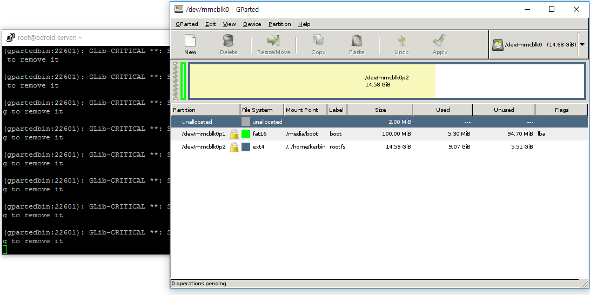
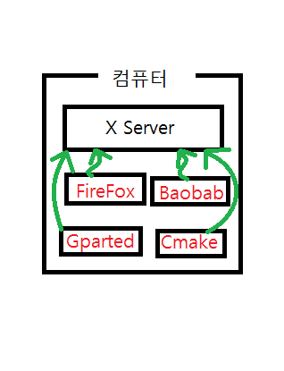
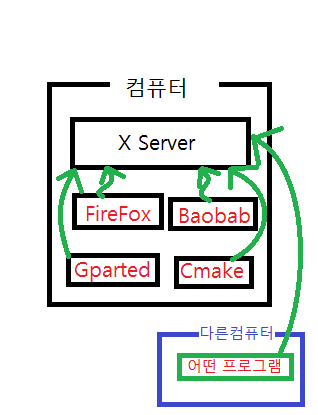
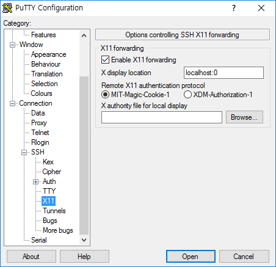
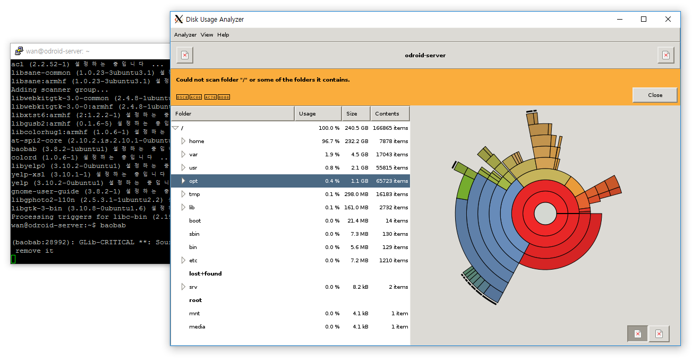
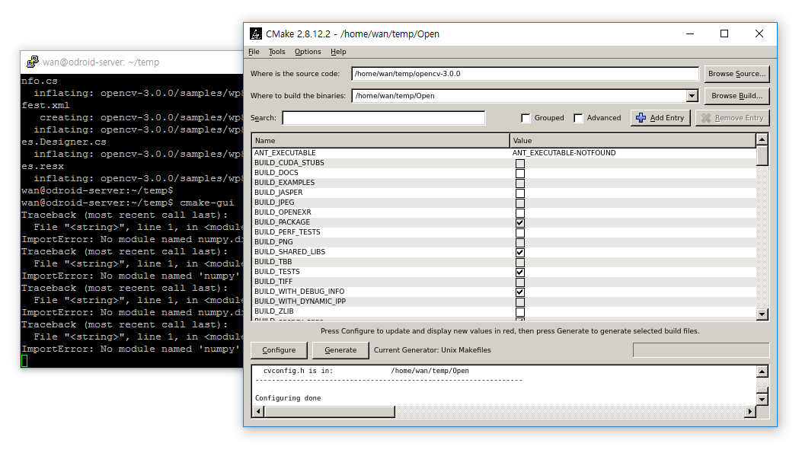

## 서론
본인은 리눅스 조작할때 어지간해서는 GUI로 안하고 SSH로 접속해 콘솔환경으로 전부 끝내는 경향이 있다. 이유는 여러가지 있지만 가장 큰 이유는 아마 리눅스 GUI의 미묘하게 불편한 응답속도에 있다. 리눅스가 원래 GUI환경이 있을꺼란 전재하에 만들어진 운영체제가 아니다보니 윈도나 맥에비해 미묘한 딜레이가 있는데 개인적으로 이 이질감이 싫어 리눅스에서 GUI는 거의 안쓴다. (리눅스 콘솔은 가끔쓰지만 보통은 윈도에서 SSH환경을 더 선호한다.)

하지만 작업을 하다보면 GUI가 훨씬더 편할때가 꼭 있다. 예를들면 하드용량 확보할때 Baobab을 써 각 폴더의 상태를 보며 작업하면 무지 편하고 cmake할때 일일히 옵션들을 켤지 끌지 정해주는것보다 마우스로 클릭클릭하며 정해주는게 더 편하다. 

이런 상황에 빠져있을 몇몇사람들을 위해 ssh X11 Forwarding 이라는 기능을 소개한다.
이 기능을 사용하면 윈도우에서도 대략

이런 화면을 볼수있게 해주는 기능이다.

참고로 이 글은 Putty를통해 한번이라도 SSH접속을 해본사람들을 대상으로 적은 글이다.
## 원리
리눅스는 본래 GUI환경을 고려하지 않고 탄생한 운영체제이다. 하지만 윈도우와 맥의 등장으로 GUI의 중요성은 갈수록 부각되어져갔고 1980년대 MIT에서 필요성에의해 X Window System 이라는 리눅스에서 GUI를 표시하는 수단을 개발해냈고 이 X Window System은 지금도 리눅스에서 가장 일반적으로 사용되는 GUI 표시수단이다. (물론 다른것도 있긴하다)

X Window System은 X Server와 X Client로 구성되어 있으며 흔히 우리가 말하는 "서버-클라이언트"의 구조를 가진다. 

여기서 X Client는 화면에 무언가를 표시할 각 프로세서들을 의미하며 (파이어폭스나 탐색기 같은) X Client가 X Server에게 화면정보를 보내면 X Server는 받은 정보에 맞게 그림을 그려서 화면에 표시해주는 역할을 한다.

이들간의 통신은 소켓으로 행해지며 소켓이란 말을 들었을때 짐작했듯이 X Client와 X Server의 존재는 하나의 컴퓨터 안에 같이 존재할 필요는 없다. 말로하니 약간 어렵고 이상하게 된거 같은데 그림으로보면 다음과 같다.

컴퓨터에 X Server라는 존재가 있고 FireFox, Baobab, Gparted, Cmake같은 존재들이 여기서 X Client가 되어 X Server로 화면 구성에대한 정보를 넘겨 X Server가 화면을 그려주는 역할을 하는것이다.

근데 여기서 이 서버-클라이언트 구조사이에 통신이 소켓으로 행해지다보니 재미난일을 만들어낼수 있는데 그것은 바로 다음과 같이

다른 컴퓨터의 X Client의 정보를 받아 자신의 컴퓨터에 화면을 표시할수도 있다는것이다.

그리고 이 아이디어를 적용시켜 윈도우에 X Server를 만들어내고 리눅스 컴퓨터에 존재하는 X Client의 화면을 윈도우에서 표시시킨게 바로 처음보여준 사진과 같은 상황인 것이다.

그리고 지금부터 알려줄 방법은 Putty를 통해 리눅스컴퓨터와 연결한 후 SSH통신 하는김에 겸사겸사 X Client에서 보내주는 정보도 받아와 **Xming**이라는 윈도우버전 X Server에 정보를 넘기는 방법이다.

## 본론
일단 서버쪽에서 필요한 사항은

1. ssh에서 X11Forwarding 사용허가
2. Xauth

이 두가지이다. 
전자의 경우 `/etc/ssh/sshd_config`에 가서 `X11Forwarding yes`부분 주석을 해제해주던가 추가해주면 되고. (일반적으론 비허가가 기본인데 일부 배포판의경우 허가가 기본인경우도 있다. 확인해보자)

후자의 경우 X11이 설치되있으면 기본적으로 설치되있다.~~한번이라도 리눅스에서 GUI실행을 해봤다면 Xauth도 설치되어있을것이다~~ 안되있다면 따로 설치해주면된다.

그후 클라이언트쪽에선 일단 
http://www.straightrunning.com/XmingNotes/
로 들어가 Xming을 다운받은뒤 안내사항에따라 적당히 설치해 주고 실행시켜주자.

    Xming은 윈도우에서 작동하는 X Server이다. 실직적으로 이놈이 화면을 그려주는거고 Putty는 통신을 중계해주는역할을 한다. 그러니 이게 없으면 화면도 없다.

그 다음 Putty 접속하기전에 `Connection - SSH - X11` 부분을

위 사진과 같이 바꿔주고 접속하면 된다.

(참고로 리눅스 컴퓨터에서 SSH접속하는경우 별 다른 설치없이 `-x` 옵션만 넣어주면 된다.)

그후 접속되는건 평소랑 같지만 gui를 요구하는 프로그램을 실행시킬경우

( baobab 을 실행시킨 모습)

( cmake-gui를 실행시킨 모습)

위 사진과 같이 새로운 창이떠서 GUI로 작업을 할수 있게된다.

해보진 않았지만 `파이어폭스`나 `이클립스`도 잘 실행이되서 윈도우에서 원격으로 리눅스 개발을 하는사람도 존재한다는 모양이다.

참고로 이 방법은 픽셀 하나하나를 전송하는 스트리밍 방식과는다르게 **어디에 버튼을 만들고 어디에 이러이러한 글씨를 써놔라**라는 정보를 전송하고 그리는건 이 화면이 보이는 컴퓨터에서 행해지는것이기 때문에 딜레이같은것도 없고 네트워크 트래픽도 별로 많이 잡아먹진 않는다. 다만 X11을 이용하지 않고 자체적인 수단으로 GUI를 구현하는 프로그램의 경우 ~~(ex : 동영상플레이어, 게임)~~ 작동하지 않는다.

## 결론
즐거운 리눅스 되세요~